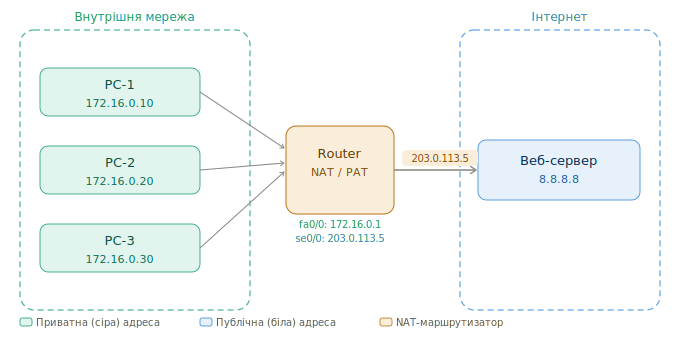

# NAT/PAT в Cisco IOS — Шпаргалка
 
> Курс: Комп'ютерні мережі | 2 курс
 
---
 
## 1 Навіщо потрібен NAT
 
IPv4-адреси публічного простору — вичерпний ресурс. Кожна організація отримує від провайдера одну або кілька **публічних (білих)** IP-адрес, тоді як усередині мережі пристрої використовують **приватні (сірі)** адреси з діапазонів RFC 1918:
 
| Діапазон | CIDR | Кількість адрес |
|----------|------|----------------|
| `10.0.0.0` – `10.255.255.255` | /8 | ~16 млн |
| `172.16.0.0` – `172.31.255.255` | /12 | ~1 млн |
| `192.168.0.0` – `192.168.255.255` | /16 | ~65 тис |
 
Приватні адреси не маршрутизуються в Інтернеті. **NAT (Network Address Translation)** вирішує цю проблему — він замінює приватну адресу на публічну при виході пакету назовні, і навпаки — при поверненні відповіді.
 
---
 
## 2 Термінологія Cisco NAT
 
| Термін | Значення |
|--------|----------|
| **Inside local** | Приватна адреса хоста всередині мережі |
| **Inside global** | Публічна адреса, якою хост представлений в Інтернеті |
| **Outside local** | Адреса зовнішнього хоста з точки зору внутрішньої мережі |
| **Outside global** | Реальна публічна адреса зовнішнього хоста |
| **Inside interface** | Інтерфейс маршрутизатора, що дивиться у внутрішню мережу |
| **Outside interface** | Інтерфейс маршрутизатора, що дивиться в Інтернет |
 
---
 
## 3 Схема мережі (для прикладів)
 
> 📁 Зображення: `assets/network-configs_cisco-nat_1.svg`
 

---
 
## 4 PAT з overload — вся мережа за однією адресою
 
**PAT (Port Address Translation)** — найпоширеніший сценарій. Всі пристрої внутрішньої мережі виходять в Інтернет через **одну публічну IP-адресу**, а розрізняються за номерами TCP/UDP-портів. Cisco також називає це **NAT overload**.
 
```
PC-1 172.16.0.10:4500  ──►  203.0.113.5:10001 ──► 8.8.8.8:443
PC-2 172.16.0.20:5100  ──►  203.0.113.5:10002 ──► 8.8.8.8:443
PC-3 172.16.0.30:6200  ──►  203.0.113.5:10003 ──► 8.8.8.8:80
```
 
Маршрутизатор зберігає таблицю трансляцій і знає, якій внутрішній адресі повернути відповідь.
 
### 4.1 Варіант 1 — overload через адресу інтерфейсу (найпростіший)
 
Підходить коли є одна публічна адреса, призначена безпосередньо на зовнішній інтерфейс.
 
```
! Крок 1 — Позначити інтерфейси
interface FastEthernet0/0
 ip address 172.16.0.1 255.255.255.0
 ip nat inside
 no shutdown
 
interface Serial0/0
 ip address 203.0.113.5 255.255.255.252
 ip nat outside
 no shutdown
 
! Крок 2 — ACL: які адреси потрібно транслювати
access-list 1 permit 172.16.0.0 0.0.0.255
 
! Крок 3 — Увімкнути NAT overload на зовнішньому інтерфейсі
ip nat inside source list 1 interface Serial0/0 overload
```
 
### 4.2 Варіант 2 — overload через пул адрес
 
Підходить, якщо є кілька публічних адрес, але всі перевантажуються через PAT.
 
```
! Крок 1 — Позначити інтерфейси (аналогічно варіанту 1)
interface FastEthernet0/0
 ip address 172.16.0.1 255.255.255.0
 ip nat inside
 
interface Serial0/0
 ip address 203.0.113.5 255.255.255.252
 ip nat outside
 
! Крок 2 — Визначити пул публічних адрес
ip nat pool PAT-POOL 203.0.113.5 203.0.113.5 prefix-length 30
! (або діапазон: 203.0.113.5 203.0.113.6 prefix-length 29)
 
! Крок 3 — ACL для внутрішніх адрес
access-list 1 permit 172.16.0.0 0.0.0.255
 
! Крок 4 — Прив'язати ACL до пулу з overload
ip nat inside source list 1 pool PAT-POOL overload
```
 
!!! tip "Який варіант використовувати?"
    Якщо є лише одна публічна IP-адреса на інтерфейсі — використовуй **варіант 1** (`interface Serial0/0 overload`). Це простіше і не потребує оголошення пулу.
 
---
 
## 5 Dynamic NAT — пул без overload
 
Кожен внутрішній хост отримує **унікальну** публічну адресу з пулу. Якщо адреси у пулі закінчились — нові з'єднання відхиляються. Підходить, коли публічних адрес вистачає для всіх.
 
```
! Позначити інтерфейси
interface FastEthernet0/0
 ip address 172.16.0.1 255.255.255.0
 ip nat inside
 
interface Serial0/0
 ip address 203.0.113.30 255.255.255.224
 ip nat outside
 
! Пул публічних адрес (203.0.113.1 – 203.0.113.20)
ip nat pool DYN-POOL 203.0.113.1 203.0.113.20 prefix-length 27
 
! ACL: лише перші 31 хост кожної підмережі
access-list 7 permit 172.16.0.0 0.0.0.31
 
! Прив'язати без overload (один до одного)
ip nat inside source list 7 pool DYN-POOL
```
 
!!! info "Динамічна таблиця трансляцій"
    На відміну від статичного NAT, записи у таблиці з'являються лише при першому пакеті і видаляються після закінчення таймауту (за замовчуванням 86400 сек для TCP, 300 сек для UDP).
 
---
 
## 6 Static NAT — один до одного
 
Постійне відображення конкретної приватної адреси на конкретну публічну. Використовується для серверів, до яких потрібен доступ ззовні (web, mail, FTP).
 
```
! Позначити інтерфейси
interface FastEthernet0/0
 ip address 172.16.0.1 255.255.255.0
 ip nat inside
 
interface Serial0/0
 ip address 203.0.113.30 255.255.255.252
 ip nat outside
 
! Статичне відображення (inside local → inside global)
ip nat inside source static 172.16.0.100 203.0.113.1   ! веб-сервер
ip nat inside source static 172.16.0.101 203.0.113.2   ! mail-сервер
```
 
!!! warning "Постійний запис у таблиці"
    Статичні NAT-записи активні постійно — незалежно від наявності трафіку. Це означає, що ззовні завжди можна ініціювати підключення до внутрішнього сервера.
 
---
 
## 7 Static NAT для порту (Port Forwarding / DNAT)
 
Перенаправлення трафіку на конкретний порт внутрішнього хоста. Корисно, коли внутрішній сервер слухає на нестандартному порту, або потрібно опублікувати кілька сервісів через одну публічну адресу.
 
```
! Перенаправити HTTP (80) ззовні на внутрішній веб-сервер (порт 8080)
ip nat inside source static tcp 172.16.0.100 8080 203.0.113.5 80
 
! Перенаправити RDP (3389) ззовні на конкретний ПК
ip nat inside source static tcp 172.16.0.50 3389 203.0.113.5 3389
 
! Перенаправити SSH (22) ззовні
ip nat inside source static tcp 172.16.0.10 22 203.0.113.5 2222
 
! Перевірка
show ip nat translations
! Pro  Inside global        Inside local        Outside local    Outside global
! tcp  203.0.113.5:80       172.16.0.100:8080   ---              ---
! tcp  203.0.113.5:3389     172.16.0.50:3389    ---              ---
```
 
---
 
## 8 Перевірка та діагностика
 
```
! Переглянути таблицю активних трансляцій
show ip nat translations
show ip nat translations verbose         ! детально (з таймаутами)
show ip nat translations tcp             ! тільки TCP
 
! Статистика NAT
show ip nat statistics
 
! Очистити таблицю трансляцій вручну
clear ip nat translation *               ! очистити всі динамічні записи
clear ip nat translation inside 172.16.0.10 outside 8.8.8.8
clear ip nat translation tcp inside 172.16.0.10 80 outside 8.8.8.8 80
 
! Debug (обережно на завантажених пристроях!)
debug ip nat                             ! всі події NAT
debug ip nat detailed                    ! детальний вивід
no debug all                             ! зупинити debug
```
 
### 8.1 Приклад виводу show ip nat translations
 
```
Router# show ip nat translations
Pro  Inside global     Inside local      Outside local    Outside global
tcp  203.0.113.5:10001 172.16.0.10:4500  8.8.8.8:443      8.8.8.8:443
tcp  203.0.113.5:10002 172.16.0.20:5100  8.8.8.8:443      8.8.8.8:443
tcp  203.0.113.5:10003 172.16.0.30:6200  8.8.8.8:80       8.8.8.8:80
---  203.0.113.1       172.16.0.100      ---              ---   ! статичний
```
 
---
 
## 9 Типові проблеми
 
| Симптом | Причина | Рішення |
|---------|---------|---------|
| Трафік не транслюється | Інтерфейси не позначені `ip nat inside/outside` | Перевірити `show ip nat statistics` → interfaces |
| ACL блокує весь трафік | Занадто жорсткий ACL | Переглянути ACL, переконатися що є `permit` |
| Таблиця трансляцій порожня | ACL не збігається з адресами | `debug ip nat` для перевірки |
| Статичний NAT не працює ззовні | Немає маршруту назад | Перевірити маршрутизацію до `inside global` |
| PAT перестав працювати | Вичерпались порти (рідко) | Пул адрес замість одного IP |
 
---
 
> 📌 **Зберегти конфігурацію:** `copy running-config startup-config` або `wr`
 
---
 
!!! quote "Джерело"
    Стаття базується на офіційній документації Cisco TAC.
    Оригінал (англійською): [Configure Network Address Translation](https://www.cisco.com/c/en/us/support/docs/ip/network-address-translation-nat/13772-12.html)