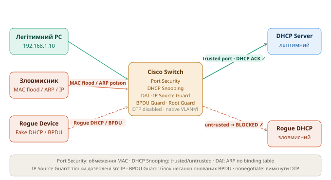

# Захист канального рівня (L2 Security) - Шпаргалка

> Курс: Безпека електронно-комунікаційних мереж | 3 курс

---

## Загальна картина

Канальний рівень OSI (L2) - одне з найбільш вразливих місць корпоративної мережі. На відміну від L3 (IP), більшість комутаторів за замовчуванням **довіряють** будь-якому пристрою що підключився до порту. Це дозволяє зловмиснику маніпулювати MAC-таблицями, ARP-кешем, DHCP-відповідями та VLAN-ізоляцією

> 📁 Схема атак та захисних механізмів:


| Атака | Ціль | Захист |
|---|---|---|
| MAC Address Flooding | Переповнити MAC-таблицю → switch стає hub | Port Security |
| Rogue DHCP Server | Підмінити шлюз/DNS → MITM | DHCP Snooping |
| ARP Spoofing / Poisoning | Підмінити ARP → MITM / DoS | DAI (Dynamic ARP Inspection) |
| IP Spoofing | Підробити source IP → обхід ACL | IP Source Guard |
| STP Manipulation | Стати Root Bridge → перехоплення трафіку | BPDU Guard, Root Guard |
| VLAN Hopping | Отримати доступ до іншого VLAN | Вимкнення DTP, native VLAN |

---

## 1 Port Security - захист від MAC Flooding

### 1.1 Проблема

**MAC Flooding**: зловмисник генерує мільйони фреймів з підробленими MAC-адресами. Таблиця MAC-адрес комутатора (CAM table) переповнюється. Комутатор починає флудити весь вхідний трафік на всі порти - перетворюється на концентратор (hub). Зловмисник перехоплює трафік між легітимними хостами

```
Зловмисник → [MAC 11:11:11, MAC 22:22:22, MAC 33:33:33 ...] → SW
CAM table переповнена → SW флудить весь трафік → зловмисник бачить чужі дані
```

### 1.2 Що робить Port Security

Обмежує кількість MAC-адрес на порту та визначає дію при порушенні.

```
! Увімкнути Port Security на access-порту
interface GigabitEthernet1/0/1
 switchport mode access
 switchport access vlan 10
 switchport port-security                          ! увімкнути
 switchport port-security maximum 2                ! максимум 2 MAC на порту
 switchport port-security violation restrict        ! дія при порушенні
 switchport port-security mac-address sticky        ! автозапам'ятовування MAC

! Три режими violation:
! protect  — відкидати фрейми з невідомих MAC, без логу, без shutdown
! restrict — відкидати + логувати + лічильник порушень
! shutdown — відключити порт (err-disabled) ← за замовчуванням
```

```
! Статично вказати дозволену MAC-адресу
interface GigabitEthernet1/0/1
 switchport port-security mac-address 00A0.1234.5678

! Sticky — зберегти першу MAC що з'явилась (в running-config)
 switchport port-security mac-address sticky
```

!!! warning "Sticky MAC та перезавантаження"
    `sticky` зберігає вивчені MAC у `running-config`. Щоб вони збереглись після перезавантаження - виконай `copy running-config startup-config`. Інакше після ребуту порт знову прийме будь-яку MAC

```
! Відновлення err-disabled порту
interface GigabitEthernet1/0/1
 shutdown
 no shutdown

! Або автоматичне відновлення (через N секунд)
errdisable recovery cause psecure-violation
errdisable recovery interval 300

! Перевірка
show port-security
show port-security interface GigabitEthernet1/0/1
show port-security address
```

### 1.3 Приклад виводу

```
Switch# show port-security interface GigabitEthernet1/0/1
Port Security              : Enabled
Port Status                : Secure-up
Violation Mode             : Restrict
Aging Time                 : 0 mins
Maximum MAC Addresses      : 2
Total MAC Addresses        : 1
Configured MAC Addresses   : 0
Sticky MAC Addresses       : 1
Last Source Address:Vlan   : 00A0.1234.5678:10
Security Violation Count   : 0
```

---

## 2 DHCP Snooping - захист від Rogue DHCP

### 2.1 Проблема

**Rogue DHCP Server**: зловмисник запускає власний DHCP-сервер в мережі. Клієнти можуть отримати відповідь від зловмисного сервера швидше ніж від легітимного. Зловмисник призначає себе шлюзом або DNS-сервером → весь трафік клієнтів проходить через нього (MITM)

```
PC → DHCPDISCOVER → [SW] → обидва DHCP-сервери отримують запит
Rogue DHCP відповідає швидше → PC отримує: GW = 192.168.1.254 (зловмисник)
```

### 2.2 Що робить DHCP Snooping

Поділяє порти на **trusted** (легітимний DHCP-сервер) та **untrusted** (всі інші). DHCP-відповіді (`OFFER`, `ACK`) блокуються на untrusted-портах. Веде **DHCP Snooping Binding Table** (IP+MAC+VLAN+Port) - використовується DAI та IP Source Guard

```
! Глобально увімкнути DHCP Snooping
ip dhcp snooping

! Увімкнути для конкретних VLAN
ip dhcp snooping vlan 10,20,30

! Вимкнути Option 82 (щоб не змінювати пакети на доступі)
no ip dhcp snooping information option

! Позначити uplink-порт до легітимного DHCP-сервера як trusted
interface GigabitEthernet1/0/24
 description "Uplink to Core / DHCP Server"
 ip dhcp snooping trust

! Всі інші порти (до ПК) — untrusted за замовчуванням

! Обмежити швидкість DHCP-запитів на untrusted-портах (захист від DHCP flood)
interface GigabitEthernet1/0/1
 ip dhcp snooping limit rate 15      ! не більше 15 пакетів/сек

! Перевірка
show ip dhcp snooping
show ip dhcp snooping binding
show ip dhcp snooping statistics
```

!!! info "DHCP Snooping Binding Table"
    Таблиця містить: IP-адресу, MAC-адресу, VLAN, порт і час оренди для кожного клієнта що отримав адресу через snooping. Ця таблиця використовується як основа для DAI та IP Source Guard

```
Switch# show ip dhcp snooping binding
MacAddress         IpAddress      Lease(sec) Type      VLAN  Interface
00:A0:12:34:56:78  192.168.1.10   86400      dynamic   10    Gi1/0/1
```

---

## 3 DAI - Dynamic ARP Inspection (захист від ARP Spoofing)

### 3.1 Проблема

**ARP Spoofing / ARP Poisoning**: зловмисник надсилає підроблені ARP-відповіді, стверджуючи що його MAC відповідає IP-адресі шлюзу (або іншого хоста). Жертви оновлюють свій ARP-кеш → весь трафік йде через зловмисника (MITM або DoS)

```
Легітимно: 192.168.1.1 → MAC aa:bb:cc:dd:ee:ff (router)
ARP Poison: зловмисник надсилає → 192.168.1.1 = MAC 11:22:33:44:55:66 (attacker)
Жертва оновлює ARP → весь трафік до шлюзу йде зловмиснику
```

### 3.2 Що робить DAI

Перевіряє кожен ARP-пакет на untrusted-порту: чи відповідає пара IP+MAC записам у DHCP Snooping Binding Table (або статичним ARP ACL). Якщо не відповідає - пакет відкидається

!!! warning "DAI вимагає DHCP Snooping"
    DAI перевіряє пари IP+MAC по DHCP Snooping Binding Table. Якщо DHCP Snooping не увімкнено або хост має статичну IP - потрібно додати статичний ARP ACL

```
! DHCP Snooping повинен бути увімкнений (див. розділ 2)

! Увімкнути DAI для VLAN
ip arp inspection vlan 10,20,30

! Позначити uplink як trusted (ARP-перевірка не виконується)
interface GigabitEthernet1/0/24
 ip arp inspection trust

! Обмеження швидкості ARP на untrusted-портах
interface GigabitEthernet1/0/1
 ip arp inspection limit rate 100      ! пакетів/сек (default: 100)
 ip arp inspection limit rate 100 burst interval 1

! Для хостів зі статичною IP (не в DHCP binding table)
! Додати статичний ARP ACL
arp access-list STATIC-HOSTS
 permit ip host 192.168.1.50 mac host 00A0.1234.ABCD
 permit ip host 192.168.1.51 mac host 00A0.1234.ABCE

ip arp inspection filter STATIC-HOSTS vlan 10

! Розширена перевірка (src-mac, dst-mac, IP валідність)
ip arp inspection validate src-mac dst-mac ip

! Перевірка
show ip arp inspection
show ip arp inspection vlan 10
show ip arp inspection statistics
show ip arp inspection interfaces
```

---

## 4 IP Source Guard - захист від IP Spoofing

### 4.1 Проблема

**IP Spoofing**: зловмисник підробляє source IP у пакетах. Може обходити ACL що фільтрують за IP-адресою джерела, або імітувати трафік від іншого хоста

### 4.2 Що робить IP Source Guard

Перевіряє source IP (та опціонально MAC) кожного пакету на untrusted-порту. Дозволяє тільки ті IP-адреси що є в DHCP Snooping Binding Table або статично налаштовані

```
! DHCP Snooping повинен бути увімкнений!

! Увімкнути IP Source Guard на untrusted-порту (тільки IP-перевірка)
interface GigabitEthernet1/0/1
 ip verify source

! Увімкнути з перевіркою і IP, і MAC (суворіший режим)
interface GigabitEthernet1/0/1
 ip verify source port-security

! Для хостів зі статичною IP — додати статичний binding
ip source binding 00A0.1234.5678 vlan 10 192.168.1.50 interface GigabitEthernet1/0/1

! Перевірка
show ip verify source
show ip source binding
```

!!! info "Залежність від DHCP Snooping"
    IP Source Guard блокує всі пакети з порту поки клієнт не отримає IP через DHCP (і запис не з'явиться в binding table). Для хостів зі статичними IP обов'язково додай `ip source binding` вручну

---

## 5 Захист STP - BPDU Guard, Root Guard, Loop Guard

### 5.1 Проблема

**STP Manipulation**: зловмисник підключає комутатор з нижчим Bridge Priority і надсилає BPDU що претендують на роль Root Bridge. Якщо зловмисник стає Root Bridge - весь трафік мережі перебудовується через нього. Або: зловмисник надсилає BPDU на access-порти щоб спровокувати перерахунок STP (DoS)

### 5.2 BPDU Guard - захист access-портів від несанкціонованих BPDU

```
! Глобально (для всіх PortFast-портів)
spanning-tree portfast bpduguard default

! На конкретному порту
interface GigabitEthernet1/0/1
 spanning-tree portfast
 spanning-tree bpduguard enable

! При спрацюванні порт переходить у err-disabled
! Автовідновлення
errdisable recovery cause bpduguard
errdisable recovery interval 300

! Перевірка
show spanning-tree inconsistentports
show interfaces status err-disabled
```

### 5.3 Root Guard - захист від підміни Root Bridge

Застосовується на downlink-портах (до access-рівня). Якщо через цей порт надходить Superior BPDU - порт переходить у `root-inconsistent` (блокується), але не відключається

```
! На портах що дивляться вниз (до access-комутаторів)
interface GigabitEthernet1/0/23
 spanning-tree guard root

! Перевірка
show spanning-tree inconsistentports
```

### 5.4 Loop Guard - захист від петель при втраті BPDU

```
! Глобально (рекомендовано на uplink/trunk)
spanning-tree loopguard default

! На конкретному порту
interface GigabitEthernet1/0/24
 spanning-tree guard loop
```

### 5.5 BPDU Filter - фільтрація BPDU на граничних портах

```
! Глобально (тільки на PortFast-портах - не надсилає BPDU назовні)
spanning-tree portfast bpdufilter default

! УВАГА: на конкретному порту повністю вимикає STP!
! Використовуй тільки на граничних портах до провайдерів
interface GigabitEthernet1/0/1
 spanning-tree bpdufilter enable
```

---

## 6 VLAN Hopping - атака та захист

### 6.1 Проблема

**VLAN Hopping** - два варіанти:

**1. Switch Spoofing**: зловмисник надсилає DTP-фрейми щоб перевести порт у trunk-режим. Отримує доступ до всіх VLAN

```
Порт у режимі dynamic auto/desirable → зловмисник надсилає DTP → порт стає trunk
Зловмисник тегує трафік VLAN 20 → отримує доступ до VLAN 20
```

**2. Double Tagging**: зловмисник додає подвійний 802.1Q тег. Зовнішній тег = native VLAN (знімається першим комутатором), внутрішній = цільовий VLAN. Трафік потрапляє у чужий VLAN

```
Зловмисник надсилає: [VLAN 1 tag][VLAN 20 tag][payload]
SW-1 знімає зовнішній тег (native VLAN 1) і пересилає далі
SW-2 бачить тег VLAN 20 → доставляє в VLAN 20
```

### 6.2 Захист від Switch Spoofing (вимкнення DTP)

```
! На ВСІХ access-портах — явний режим + вимкнення DTP
interface range GigabitEthernet1/0/1 - 20
 switchport mode access
 switchport nonegotiate            ! вимкнути DTP

! На trunk-портах між комутаторами — явний trunk + nonegotiate
interface GigabitEthernet1/0/24
 switchport mode trunk
 switchport nonegotiate

! Вимкнути невикористані порти
interface range GigabitEthernet1/0/21 - 22
 switchport mode access
 switchport access vlan 999        ! "чорна діра" VLAN
 shutdown
```

### 6.3 Захист від Double Tagging (native VLAN)

```
! Змінити native VLAN з 1 на невикористовуваний VLAN
interface GigabitEthernet1/0/24
 switchport trunk native vlan 999  ! не VLAN 1!

! Або — тегувати native VLAN (IEEE 802.1Q все одно буде без тегу, але Cisco може)
vlan dot1q tag native               ! глобально на платформах що підтримують

! Заборонити native VLAN на транку (не передавати)
interface GigabitEthernet1/0/24
 switchport trunk allowed vlan remove 1
 switchport trunk allowed vlan remove 999  ! і native теж

! Обмежити дозволені VLAN на транку (тільки потрібні)
interface GigabitEthernet1/0/24
 switchport trunk allowed vlan 10,20,30
```

!!! info "Чому VLAN 1 небезпечний як native"
    VLAN 1 — native VLAN за замовчуванням на всіх Cisco комутаторах і саме на нього розрахована атака Double Tagging. Якщо зловмисник знаходиться в access-порту VLAN 1 — атака спрацьовує без будь-яких додаткових дій

---

## 7 Повна конфігурація захищеного access-порту

```
! Шаблон для типового access-порту з усіма захисними механізмами

interface GigabitEthernet1/0/1
 description "PC - VLAN 10 - secured"
 switchport mode access
 switchport access vlan 10
 switchport nonegotiate                        ! вимкнути DTP

 ! Port Security
 switchport port-security
 switchport port-security maximum 1            ! тільки 1 MAC
 switchport port-security violation restrict
 switchport port-security mac-address sticky

 ! STP
 spanning-tree portfast
 spanning-tree bpduguard enable

 ! DHCP Snooping rate limit
 ip dhcp snooping limit rate 15

 ! IP Source Guard
 ip verify source

 ! ARP rate limit
 ip arp inspection limit rate 100

 no shutdown
```

---

## 8 Повна конфігурація захищеного trunk-порту (uplink)

```
! Uplink до core/distribution або до DHCP-сервера

interface GigabitEthernet1/0/24
 description "Uplink to Core SW"
 switchport mode trunk
 switchport nonegotiate
 switchport trunk native vlan 999              ! не VLAN 1
 switchport trunk allowed vlan 10,20,30        ! тільки потрібні VLAN

 ! Trusted для DHCP Snooping та DAI
 ip dhcp snooping trust
 ip arp inspection trust

 ! STP захист
 spanning-tree guard root                      ! не дозволяти стати Root Bridge через цей порт
 spanning-tree guard loop

 no shutdown
```

---

## 9 Порядок глобального налаштування на комутаторі

```
! 1. DHCP Snooping (перший — бо DAI і IP SG залежать від нього)
ip dhcp snooping
ip dhcp snooping vlan 10,20,30
no ip dhcp snooping information option

! 2. DAI
ip arp inspection vlan 10,20,30
ip arp inspection validate src-mac dst-mac ip

! 3. STP глобально
spanning-tree mode rapid-pvst
spanning-tree portfast default
spanning-tree portfast bpduguard default
spanning-tree portfast bpdufilter default
spanning-tree loopguard default

! 4. Errdisable recovery
errdisable recovery cause bpduguard
errdisable recovery cause psecure-violation
errdisable recovery cause arp-inspection
errdisable recovery interval 300

! 5. Налаштувати інтерфейси (access і trunk — див. розділи 7 і 8)
```

---

## 10 Перевірка та діагностика

```
! Port Security
show port-security
show port-security interface GigabitEthernet1/0/1
show port-security address

! DHCP Snooping
show ip dhcp snooping
show ip dhcp snooping binding
show ip dhcp snooping statistics

! DAI
show ip arp inspection
show ip arp inspection vlan 10
show ip arp inspection statistics
show ip arp inspection interfaces

! IP Source Guard
show ip verify source
show ip source binding

! STP захист
show spanning-tree inconsistentports
show interfaces status err-disabled
show errdisable recovery

! VLAN та trunk
show interfaces trunk
show vlan brief
show interfaces GigabitEthernet1/0/1 switchport
```

### 10.1 Типові помилки

| Симптом | Причина | Рішення |
|---|---|---|
| Клієнти не отримують IP | DAI/IP SG увімкнені без DHCP Snooping | Увімкнути `ip dhcp snooping` + `ip dhcp snooping vlan` |
| Легітимний DHCP-сервер не відповідає | Uplink не позначено як `trusted` | `ip dhcp snooping trust` на uplink |
| ARP не проходить для статичних IP | Хост не в DHCP binding table | Додати `arp access-list` або статичний `ip source binding` |
| Порт у err-disabled після BPDU | BPDU Guard спрацював | Вимкнути/увімкнути порт або дочекатись `errdisable recovery` |
| ПК не підключається (Port Security) | MAC-ліміт перевищено | `show port-security`, перевірити maximum або очистити binding |
| VLAN Hopping досі можливий | Native VLAN = VLAN 1 | Змінити native VLAN на всіх транках на невикористовуваний |

---

> 📌 **Після налаштування обов'язково зберегти:**
> ```
> copy running-config startup-config
> ```