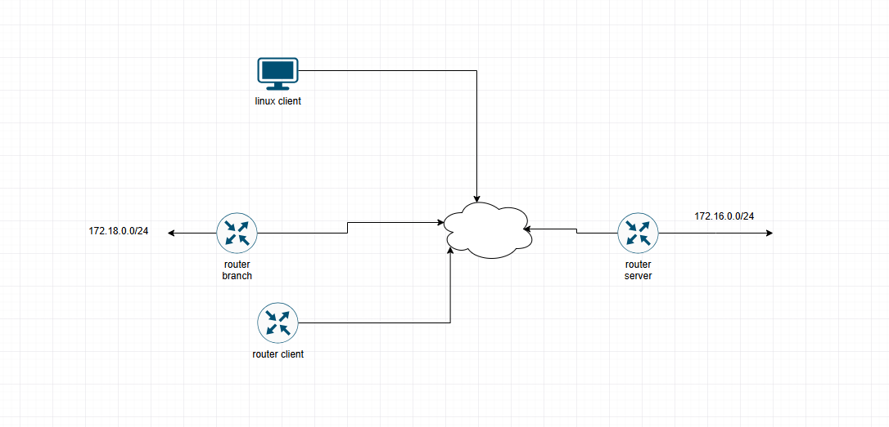
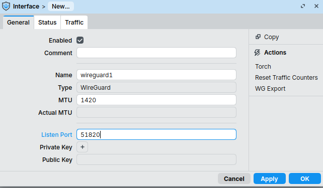
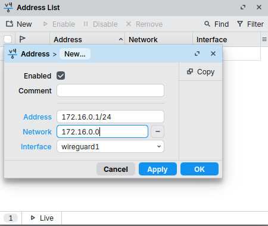
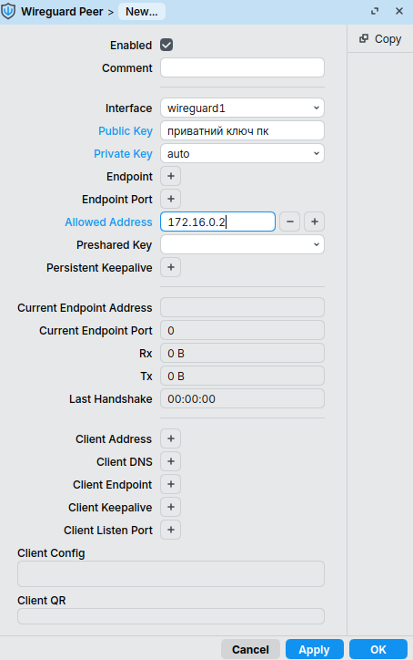
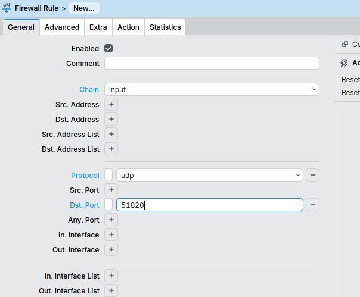

# Налаштування WireGuard на MikroTik

У цій інструкції розглядається налаштування VPN WireGuard для двох найбільш поширених сценаріїв використання:

- Remote Access VPN (віддалений доступ окремого користувача до мережі)
- Site-to-Site VPN (об'єднання двох локальних мереж через Інтернет)

---

## Теоретичні відомості

WireGuard — сучасний VPN-протокол, що використовує криптографію на основі пари ключів (Public Key та Private Key)

Для роботи тунелю кожен вузол повинен мати:

- приватний ключ (Private Key)
- публічний ключ (Public Key)
- IP-адресу всередині VPN-тунелю

Кожен WireGuard Peer описує віддалений вузол та перелік мереж, які доступні через нього

Переваги WireGuard:

- проста конфігурація
- висока продуктивність
- невелика кількість службового трафіку
- підтримка RouterOS, Linux, Windows, macOS та мобільних платформ

---

# Схема 1. Remote Access VPN

У цьому сценарії Linux-комп'ютер підключається до мережі через WireGuard-тунель



## Схема адресації

| Пристрій | Адреса |
|-----------|-----------|
| MikroTik Server | 172.16.0.1/24 |
| Linux Client | 172.16.0.2/24 |

---

## Створення WireGuard-сервера

Перейдіть до меню:

**WireGuard**

Створіть інтерфейс із параметрами:

```text
Name: wg-server
Listen Port: 51820
```

Після створення відкрийте інтерфейс повторно та скопіюйте значення **Public Key**



---

## Призначення IP-адреси тунелю

Перейдіть до меню:

**IP → Addresses**

Створіть новий запис:

```text
Address: 172.16.0.1/24
Interface: wg-server
```


---

## Додавання Linux-клієнта

Відкрийте вкладку **Peers** та додайте нового вузла

```text
Interface: wg-server
Public Key: <linux-public-key>
Allowed Address: 172.16.0.2/32
```



> Для кожного Peer рекомендується використовувати мережеву маску `/32`

---

## Налаштування Firewall

Перейдіть до меню:

**IP → Firewall → Filter Rules**

Створіть правило:

```text
Chain: input
Protocol: udp
Dst. Port: 51820
Action: accept
```

Розташуйте правило вище правил блокування



---

# Налаштування Linux-клієнта

## Встановлення WireGuard

```bash
sudo apt update
sudo apt install wireguard -y
```

---

## Генерація ключів

```bash
cd /etc/wireguard

wg genkey | sudo tee private.key | wg pubkey | sudo tee public.key
```

Переглянути публічний ключ:

```bash
sudo cat public.key
```

Скопіюйте отримане значення до налаштувань Peer на MikroTik

---

## Створення конфігурації клієнта

Створіть файл:

```bash
sudo nano /etc/wireguard/wg0.conf
```

Вміст файлу:

```ini
[Interface]
PrivateKey = <client-private-key>
Address = 172.16.0.2/24

[Peer]
PublicKey = <mikrotik-public-key>
Endpoint = <public-ip-or-fqdn>:51820
AllowedIPs = 172.16.0.0/24
PersistentKeepalive = 25
```

### Пояснення параметрів

- `PrivateKey` — приватний ключ клієнта
- `PublicKey` — публічний ключ маршрутизатора
- `Endpoint` — публічна IP-адреса або DNS-ім'я сервера
- `AllowedIPs` — мережі, доступні через VPN
- `PersistentKeepalive` — періодична передача пакетів для підтримки NAT-трансляції

---

## Запуск тунелю

```bash
sudo chmod 600 /etc/wireguard/wg0.conf
sudo wg-quick up wg0
```

Перевірити стан:

```bash
sudo wg
```

Автоматичний запуск після перезавантаження:

```bash
sudo systemctl enable wg-quick@wg0
```

---

## Перевірка роботи

Перевірте доступність сервера:

```bash
ping 172.16.0.1
```

Перевірте наявність handshake:

```bash
sudo wg
```

---

# Схема 2. Site-to-Site VPN

У цьому сценарії через WireGuard об'єднуються дві локальні мережі.

```text
             Головний офіс

        LAN: 192.168.10.0/24
                 |
         +---------------+
         | MikroTik HQ   |
         | 172.16.0.1    |
         +---------------+
                 |
           Internet
                 |
         +---------------+
         | MikroTik BR   |
         | 172.16.0.2    |
         +---------------+
                 |
        LAN: 192.168.20.0/24

               Філія
```

---

## Схема адресації

| Мережа | Адреса |
|----------|----------|
| HQ LAN | 192.168.10.0/24 |
| Branch LAN | 192.168.20.0/24 |
| WireGuard | 172.16.0.0/24 |

---

## Налаштування маршрутизатора філії

Створіть інтерфейс:

```text
Name: wg-client
Listen Port: 51820
```

Збережіть його Public Key.

---

## IP-адреса тунелю

```text
Address: 172.16.0.2/24
Interface: wg-client
```

---

## Додавання сервера

Створіть Peer:

```text
Interface: wg-client
Public Key: <server-public-key>

Endpoint Address: <server-public-ip>
Endpoint Port: 51820

Allowed Address:
172.16.0.1/32
192.168.10.0/24

Persistent Keepalive: 25
```

---

## Налаштування сервера

На центральному маршрутизаторі додайте Peer:

```text
Public Key: <branch-public-key>

Allowed Address:
172.16.0.2/32
192.168.20.0/24
```

---

## Перевірка маршрутизації

З вузла мережі HQ:

```bash
ping 192.168.20.x
```

З вузла мережі Branch:

```bash
ping 192.168.10.x
```

---

# Діагностика

## Linux

Перевірка інтерфейсу:

```bash
ip addr show wg0
```

Перевірка маршрутів:

```bash
ip route
```

Перевірка WireGuard:

```bash
sudo wg
```

---

## MikroTik

Перевірка WireGuard-інтерфейсів:

```text
/interface/wireguard print
```

Перевірка Peer:

```text
/interface/wireguard/peers print detail
```

Перегляд журналу подій:

```text
/log print
```

---

## Корисні посилання

- https://help.mikrotik.com/docs/display/ROS/WireGuard
- https://www.wireguard.com/quickstart/

---

> Автор: Ed