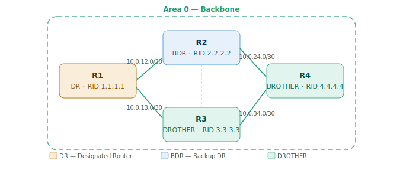
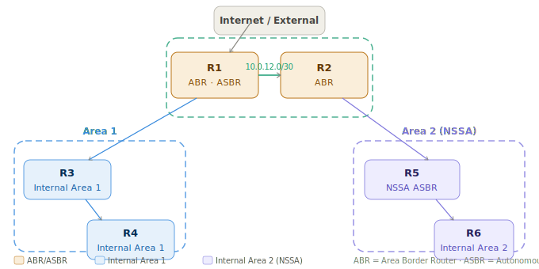

# OSPFv2 - Повна шпаргалка з налаштування
 
> Курс: Комп'ютерні мережі | 2-3 курс
 
---
 
## 1 Принцип роботи OSPF
 
**OSPF (Open Shortest Path First)** - протокол динамічної маршрутизації стану каналу (Link-State). На відміну від дистанційно-векторних протоколів (RIP, EIGRP), кожен маршрутизатор OSPF будує повну топологічну карту мережі та самостійно розраховує найкоротший шлях до кожної підмережі за алгоритмом Дейкстри (SPF)
 
### 1.1 Алгоритм роботи (покроково)
 
```
1. Встановлення сусідства (adjacency)
   └─ маршрутизатори обмінюються Hello-пакетами
   └─ погоджують параметри: Area ID, Hello/Dead timer, MTU, аутентифікація
 
2. Обмін LSA (Link-State Advertisement)
   └─ кожен маршрутизатор описує свої канали та сусідів у LSA
   └─ LSA поширюються по всій зоні → формується LSDB
 
3. Побудова топологічної карти (LSDB - Link-State Database)
   └─ всі маршрутизатори зони мають ідентичну LSDB
 
4. Розрахунок SPF-дерева (Dijkstra)
   └─ кожен маршрутизатор незалежно обраховує найкоротший шлях
   └─ результат → таблиця маршрутизації (RIB)
 
5. Підтримка актуальності
   └─ Hello-пакети кожні 10 сек (P2P) або 10 сек (broadcast)
   └─ Dead interval: 40 сек - якщо немає Hello → сусід "мертвий"
   └─ При змінах топології → flood нових LSA → перерахунок SPF
```
 
### 1.2 Метрика OSPF - Cost
 
OSPF використовує **cost** як метрику. Менший cost = кращий шлях
 
```
Cost = Reference Bandwidth / Interface Bandwidth
 
Reference Bandwidth за замовчуванням: 100 Mbps (100 000 Kbps)
 
FastEthernet (100 Mbps):  100 / 100  = 1
GigabitEthernet (1 Gbps): 100 / 1000 = 0.1 → округлюється до 1 (!)
10GigabitEthernet:        100 / 10000 = 0.01 → також 1 (!)
```
 
!!! warning "Проблема з reference-bandwidth за замовчуванням"
    В мережах з Gigabit та 10G інтерфейсами всі отримують cost=1 - OSPF не розрізняє їх. Завжди змінюй reference-bandwidth на відповідне значення для твоєї мережі (наприклад 10000 для 10G)
 
### 1.3 Вибір Router ID (RID)
 
RID - унікальний ідентифікатор маршрутизатора в OSPF. Вибирається автоматично:
 
```
Пріоритет вибору RID:
1. Вручну налаштований: router-id X.X.X.X  ← завжди використовуй!
2. Найвища IP-адреса loopback-інтерфейсу
3. Найвища IP-адреса фізичного інтерфейсу
```
 
!!! tip "Завжди налаштовуй RID вручну"
    Без явного `router-id` RID може змінитись при зміні IP-адрес або додаванні інтерфейсів. Це призводить до перебудови сусідства і нестабільності мережі
 
### 1.4 DR/BDR - Designated Router / Backup DR
 
На broadcast-мережах (Ethernet) OSPF обирає DR та BDR для зменшення кількості LSA-обмінів.
 
```
Без DR/BDR: N*(N-1)/2 adjacency (n=5 → 10 з'єднань)
З DR/BDR:   (N-1)*2 adjacency  (n=5 → 8 з'єднань)
```
 
> 📁 Схема Area 0 з DR/BDR: `assets/network-configs_ospf_1.svg`



**Вибір DR/BDR:**
 
```
1. Найвищий OSPF Priority (за замовчуванням: 1, діапазон: 0–255)
   Priority = 0 → маршрутизатор ніколи не стане DR/BDR
2. При рівному Priority - перемагає найвищий Router ID
```
 
!!! info "DR/BDR не змінюються автоматично"
    Якщо з'явився маршрутизатор з вищим пріоритетом - DR не змінюється до наступного перезапуску OSPF або команди `clear ip ospf process`. OSPF DR/BDR - "non-preemptive"
 
### 1.5 Типи LSA
 
| Тип | Назва | Генерує | Поширення |
|-----|-------|---------|-----------|
| 1 | Router LSA | Кожен маршрутизатор | В межах зони |
| 2 | Network LSA | DR | В межах зони |
| 3 | Summary LSA | ABR | Між зонами (з Area 0) |
| 4 | ASBR Summary LSA | ABR | Між зонами |
| 5 | AS External LSA | ASBR | По всьому OSPF-домену |
| 7 | NSSA External LSA | ASBR в NSSA | Тільки в NSSA зоні |
 
---
 
## 2 Однозонна конфігурація (Single Area OSPF)
 
> 📁 Схема: `assets/network-configs_ospf_1.svg`
 

Всі маршрутизатори - Area 0
 
### 2.1 Базове налаштування на всіх маршрутизаторах
 
**R1 (буде DR - найвищий пріоритет):**
 
```
! Налаштування loopback для стабільного RID
interface Loopback0
 ip address 1.1.1.1 255.255.255.255
 
! Запуск OSPF
router ospf 1
 router-id 1.1.1.1
 ! Оголосити всі інтерфейси в Area 0 (маска 0.0.0.255 = /24 підмережі)
 network 10.0.0.0 0.0.255.255 area 0
 network 1.1.1.1 0.0.0.0 area 0
 ! Reference bandwidth для коректного cost на GigabitEthernet
 auto-cost reference-bandwidth 1000
 
! Підвищити пріоритет щоб стати DR
interface GigabitEthernet0/0
 ip ospf priority 255
```
 
**R2 (буде BDR):**
 
```
interface Loopback0
 ip address 2.2.2.2 255.255.255.255
 
router ospf 1
 router-id 2.2.2.2
 network 10.0.0.0 0.0.255.255 area 0
 network 2.2.2.2 0.0.0.0 area 0
 auto-cost reference-bandwidth 1000
 
interface GigabitEthernet0/0
 ip ospf priority 100           ! Другий за пріоритетом → BDR
```
 
**R3, R4 (DROTHER):**
 
```
interface Loopback0
 ip address 3.3.3.3 255.255.255.255  ! (або 4.4.4.4 для R4)
 
router ospf 1
 router-id 3.3.3.3
 network 10.0.0.0 0.0.255.255 area 0
 network 3.3.3.3 0.0.0.0 area 0
 auto-cost reference-bandwidth 1000
 ! Пріоритет 1 за замовчуванням — не стануть DR/BDR
```
 
### 2.2 Налаштування cost на інтерфейсі
 
```
! Спосіб 1 — вручну задати cost на інтерфейсі
interface GigabitEthernet0/1
 ip ospf cost 10
 
! Спосіб 2 — змінити глобальну reference-bandwidth (рекомендовано)
router ospf 1
 auto-cost reference-bandwidth 1000    ! Mbps (для мережі з 1G посиланнями)
 auto-cost reference-bandwidth 10000   ! Mbps (для мережі з 10G посиланнями)
```
 
### 2.3 Налаштування таймерів Hello/Dead
 
```
! На інтерфейсі (повинні збігатись на обох кінцях каналу!)
interface GigabitEthernet0/0
 ip ospf hello-interval 10      ! за замовчуванням: 10 сек (Broadcast)
 ip ospf dead-interval 40       ! за замовчуванням: 40 сек
 
! Прискорений варіант (для швидкої конвергенції)
interface GigabitEthernet0/0
 ip ospf hello-interval 2
 ip ospf dead-interval 8
 
! BFD (Bidirectional Forwarding Detection) — найшвидше виявлення
interface GigabitEthernet0/0
 ip ospf bfd
```
 
### 2.4 Пасивні інтерфейси (passive-interface)
 
Інтерфейси до кінцевих пристроїв (LAN) не повинні надсилати OSPF Hello. Оголошувати підмережу - так, шукати сусідів - ні.
 
```
router ospf 1
 ! Зробити всі інтерфейси пасивними за замовчуванням
 passive-interface default
 ! Вибірково увімкнути OSPF на інтерфейсах до сусідів
 no passive-interface GigabitEthernet0/0
 no passive-interface GigabitEthernet0/1
```
 
### 2.5 Аутентифікація OSPF
 
```
! MD5 аутентифікація на інтерфейсі (рекомендовано)
interface GigabitEthernet0/0
 ip ospf authentication message-digest
 ip ospf message-digest-key 1 md5 StrongPassword123
 
! Або — аутентифікація для всієї зони (в процесі OSPF)
router ospf 1
 area 0 authentication message-digest
 
! SHA-256 (IOS XE 16.x+)
router ospf 1
 area 0 authentication key-chain OSPF-KEYCHAIN
key chain OSPF-KEYCHAIN
 key 1
  key-string StrongPassword123
  cryptographic-algorithm hmac-sha-256
```
 
---
 
## 3 Передача маршруту за замовчуванням
 
Маршрутизатор з виходом в Інтернет (ASBR) передає default route решті маршрутизаторів OSPF
 
```
! R1 підключений до Інтернету через статичний маршрут
ip route 0.0.0.0 0.0.0.0 203.0.113.1
 
! Передати default route в OSPF
router ospf 1
 default-information originate              ! тільки якщо є 0.0.0.0/0 в таблиці
 ! або:
 default-information originate always       ! передавати завжди (навіть без маршруту)
 ! з метрикою та типом:
 default-information originate always metric 100 metric-type 1
```
 
!!! info "metric-type 1 vs 2"
    **Type 1 (E1):** зовнішня метрика + внутрішня OSPF cost. Враховує відстань до ASBR.
    **Type 2 (E2):** тільки зовнішня метрика (за замовчуванням). Не змінюється при поширенні по домену. E1 кращий при кількох точках виходу в Інтернет
 
---
 
## 4 Багатозонна конфігурація (Multi-Area OSPF)
 
> 📁 Схема: `assets/network-configs_ospf_2.svg`
 


### 4.1 Налаштування ABR (R1 - Area 0 + Area 1)
 
```
interface Loopback0
 ip address 1.1.1.1 255.255.255.255
 
! Інтерфейс до Area 0
interface GigabitEthernet0/0
 ip address 10.0.12.1 255.255.255.252
 ip ospf 1 area 0               ! альтернативний спосіб оголошення (per-interface)
 
! Інтерфейс до Area 1
interface GigabitEthernet0/1
 ip address 10.1.13.1 255.255.255.252
 ip ospf 1 area 1
 
router ospf 1
 router-id 1.1.1.1
 network 1.1.1.1 0.0.0.0 area 0
 auto-cost reference-bandwidth 1000
 passive-interface default
 no passive-interface GigabitEthernet0/0
 no passive-interface GigabitEthernet0/1
```
 
### 4.2 Налаштування ABR (R2 - Area 0 + Area 2 NSSA)
 
```
interface Loopback0
 ip address 2.2.2.2 255.255.255.255
 
interface GigabitEthernet0/0
 ip address 10.0.12.2 255.255.255.252
 
interface GigabitEthernet0/1
 ip address 10.2.25.1 255.255.255.252
 
router ospf 1
 router-id 2.2.2.2
 network 2.2.2.2 0.0.0.0 area 0
 network 10.0.12.0 0.0.0.3 area 0
 network 10.2.25.0 0.0.0.3 area 2
 area 2 nssa                    ! оголосити Area 2 як NSSA
 auto-cost reference-bandwidth 1000
```
 
### 4.3 Налаштування внутрішнього маршрутизатора Area 1 (R3)
 
```
interface Loopback0
 ip address 3.3.3.3 255.255.255.255
 
interface GigabitEthernet0/0
 ip address 10.1.13.2 255.255.255.252
 
interface GigabitEthernet0/1
 ip address 10.1.34.1 255.255.255.252
 
router ospf 1
 router-id 3.3.3.3
 network 3.3.3.3 0.0.0.0 area 1
 network 10.1.0.0 0.0.255.255 area 1
 auto-cost reference-bandwidth 1000
```
 
### 4.4 NSSA ASBR (R5) - передача зовнішніх маршрутів в Area 2
 
```
interface Loopback0
 ip address 5.5.5.5 255.255.255.255
 
router ospf 1
 router-id 5.5.5.5
 network 5.5.5.5 0.0.0.0 area 2
 network 10.2.0.0 0.0.255.255 area 2
 area 2 nssa
 ! Редистрибуція зовнішніх маршрутів у NSSA (LSA Type 7)
 redistribute connected subnets metric 20 metric-type 1
 redistribute static subnets
```
 
---
 
## 5 Агрегація маршрутів (Route Summarization)
 
### 5.1 Агрегація між зонами (на ABR)
 
```
! R1 — ABR між Area 0 та Area 1
! Замість передачі 10.1.10.0/24, 10.1.20.0/24, 10.1.30.0/24 →
! передати один агрегований маршрут 10.1.0.0/16
 
router ospf 1
 area 1 range 10.1.0.0 255.255.0.0            ! агрегація при передачі з Area 1 в Area 0
 area 1 range 10.1.0.0 255.255.0.0 cost 50    ! з явним cost
 
! Для Area 2:
 area 2 range 10.2.0.0 255.255.0.0
```
 
### 5.2 Агрегація зовнішніх маршрутів (на ASBR)
 
```
router ospf 1
 summary-address 172.16.0.0 255.255.0.0       ! агрегація перед редистрибуцією
```
 
---
 
## 6 Stub та NSSA зони
 
### 6.1 Stub Area - зона без зовнішніх маршрутів
 
У stub-зоні блокуються LSA Type 5 (External). ABR надсилає замість них один default route.
 
```
! На ABR (R1) та всіх маршрутизаторах Area 1 — параметр повинен збігатись!
router ospf 1
 area 1 stub
 
! Totally Stub — блокує і LSA Type 3 (Summary), тільки default route
! Налаштовується ТІЛЬКИ на ABR:
router ospf 1
 area 1 stub no-summary
! На внутрішніх маршрутизаторах Area 1 — тільки:
 area 1 stub
```
 
### 6.2 NSSA - Not-So-Stubby Area
 
NSSA дозволяє мати локальний ASBR (зовнішні маршрути через LSA Type 7), але блокує LSA Type 5 з інших зон.
 
```
! На ABR (R2) та всіх маршрутизаторах Area 2:
router ospf 1
 area 2 nssa
 
! Totally NSSA (тільки на ABR):
router ospf 1
 area 2 nssa no-summary
 
! NSSA з автоматичним default route від ABR:
router ospf 1
 area 2 nssa default-information-originate
```
 
---
 
## 7 Virtual Link - з'єднання незв'язаних зон через Area 0
 
Virtual Link використовується коли нова зона не має прямого з'єднання з Area 0.
 
```
Ситуація:
[Area 0 · R1]──[Area 1 · R2]──[Area 2 · R3]
                                ← Area 2 не підключена до Area 0!
 
Рішення — Virtual Link між R2 та R3 через Area 1:
```
 
```
! На R2 (transit area = Area 1, peer RID = 3.3.3.3)
router ospf 1
 area 1 virtual-link 3.3.3.3
 
! На R3 (transit area = Area 1, peer RID = 2.2.2.2)
router ospf 1
 area 1 virtual-link 2.2.2.2
 
! Virtual Link з аутентифікацією:
router ospf 1
 area 1 virtual-link 3.3.3.3 authentication message-digest \
         message-digest-key 1 md5 VLinkPass
```
 
!!! warning "Virtual Link - тимчасове рішення"
    Virtual Link вирішує проблему але не є кращою практикою. По можливості перепроєктуй топологію щоб всі зони мали фізичне з'єднання з Area 0.
 
---
 
## 8 Редистрибуція маршрутів у OSPF
 
```
! Редистрибуція статичних маршрутів
router ospf 1
 redistribute static subnets metric 20 metric-type 1
 
! Редистрибуція підключених інтерфейсів
router ospf 1
 redistribute connected subnets
 
! Редистрибуція з іншого OSPF-процесу
router ospf 1
 redistribute ospf 2 subnets metric 30
 
! Редистрибуція BGP
router ospf 1
 redistribute bgp 65000 subnets metric 100 metric-type 1
 
! Редистрибуція з route-map (фільтрація)
router ospf 1
 redistribute static subnets route-map STATIC-TO-OSPF
 
route-map STATIC-TO-OSPF permit 10
 match ip address prefix-list ALLOWED-NETS
 
ip prefix-list ALLOWED-NETS seq 10 permit 172.16.0.0/16 le 24
```
 
---
 
## 9 Налаштування типу мережі OSPF
 
```
! Типи мережі та їх особливості:
! broadcast (Ethernet за замовчуванням) — є DR/BDR
! point-to-point (Serial, Loopback) — немає DR/BDR, один сусід
! non-broadcast (Frame Relay) — є DR/BDR, сусіди вручну
! point-to-multipoint — немає DR/BDR, автовизначення сусідів
 
! Змінити тип мережі (наприклад P2P між двома роутерами на Ethernet)
interface GigabitEthernet0/0
 ip ospf network point-to-point    ! прибирає DR/BDR — прискорює конвергенцію
 
! На serial-інтерфейсах
interface Serial0/0
 ip ospf network point-to-point    ! за замовчуванням і так P2P
```
 
---
 
## 10 Перевірка та діагностика
 
```
! Стан OSPF процесу та загальна інформація
show ip ospf
show ip ospf 1
 
! Список сусідів
show ip ospf neighbor
show ip ospf neighbor detail
 
! Таблиця маршрутизації (тільки OSPF-маршрути)
show ip route ospf
show ip route ospf | include O
 
! LSDB — Link-State Database
show ip ospf database
show ip ospf database router              ! LSA Type 1
show ip ospf database network             ! LSA Type 2
show ip ospf database summary             ! LSA Type 3
show ip ospf database external            ! LSA Type 5
show ip ospf database nssa-external       ! LSA Type 7
 
! Інтерфейси OSPF
show ip ospf interface
show ip ospf interface GigabitEthernet0/0
show ip ospf interface brief
 
! Статистика DR/BDR виборів
show ip ospf election
 
! Вартість (cost) шляхів
show ip ospf border-routers
 
! Агреговані маршрути
show ip ospf summary-address
 
! Virtual Links
show ip ospf virtual-links
```
 
### 10.1 Приклад виводу show ip ospf neighbor
 
```
Router# show ip ospf neighbor
Neighbor ID  Pri   State     Dead Time  Address       Interface
2.2.2.2      100   FULL/BDR  00:00:38   10.0.12.2     Gi0/0
3.3.3.3      1     FULL/DROTHER 00:00:35 10.0.13.2   Gi0/1
4.4.4.4      1     FULL/DROTHER 00:00:37 10.0.14.2   Gi0/2
```
 
### 10.2 Типові проблеми сусідства
 
| Стан | Проблема | Рішення |
|------|---------|---------|
| `INIT` | Hello отримані, але RID відсутній у них | Перевірити мережеву доступність (ACL, MTU) |
| `2-WAY` | Нормально для DROTHER-DROTHER | Не проблема |
| `EXSTART` | Проблема MTU | `ip ospf mtu-ignore` на інтерфейсі |
| `EXCHANGE` | Дублікати RID | Перевірити унікальність `router-id` |
| `LOADING` | Проблема з LSA | `clear ip ospf process` |
| Немає сусіда | Різні Area ID, таймери або аутентифікація | Порівняти конфіги на обох кінцях |
 
---
 
## 11 Debug OSPF
 
```
! Базові події OSPF
debug ip ospf events
debug ip ospf adj                  ! adjacency events (рекомендовано для troubleshooting)
debug ip ospf hello                ! hello packets (багато виводу!)
debug ip ospf flooding             ! LSA flooding
debug ip ospf spf                  ! SPF calculation events
debug ip ospf spf statistic        ! статистика SPF
 
! Зупинити debug
no debug all
undebug all
 
! Фільтрований debug (тільки для конкретного сусіда)
debug ip ospf adj | include 2.2.2.2
```
 
!!! danger "Debug на продуктивних маршрутизаторах"
    `debug ip ospf hello` генерує пакети кожні 10 секунд на кожен інтерфейс. При великій кількості сусідів — може перевантажити CPU. Завжди застосовуй `| include` фільтр або вмикай debug на короткий час.
 
---
 
## 12 Оптимізація таймерів SPF
 
```
! Throttle SPF — контроль частоти перерахунку SPF
router ospf 1
 timers throttle spf 500 1000 10000
 ! spf-start: 500 мс — затримка першого SPF після події
 ! spf-hold:  1000 мс — мінімальна затримка між SPF
 ! spf-max:   10000 мс — максимальна затримка
 
! Throttle LSA — контроль частоти генерації LSA
router ospf 1
 timers throttle lsa all 0 5000 5000
 ! start: 0 — одразу генерувати перший LSA
 ! hold: 5000 мс — затримка між повторними LSA
 ! max: 5000 мс — максимальна затримка
 
! Incremental SPF (тільки перераховує змінену частину дерева)
router ospf 1
 ispf
```
 
---
 
> 📌 **Зберегти конфігурацію:** `copy running-config startup-config` або `write memory`
 
---
 
!!! quote "Джерело"
    Стаття базується на офіційній документації Cisco.
    Оригінал (англійською): [IP Routing: OSPF Configuration Guide](https://www.cisco.com/c/en/us/td/docs/ios-xml/ios/iproute_ospf/configuration/xe-16/iro-xe-16-book/iro-cfg.html)