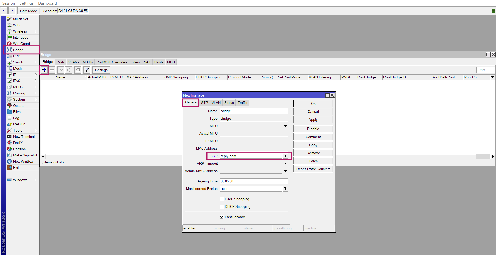
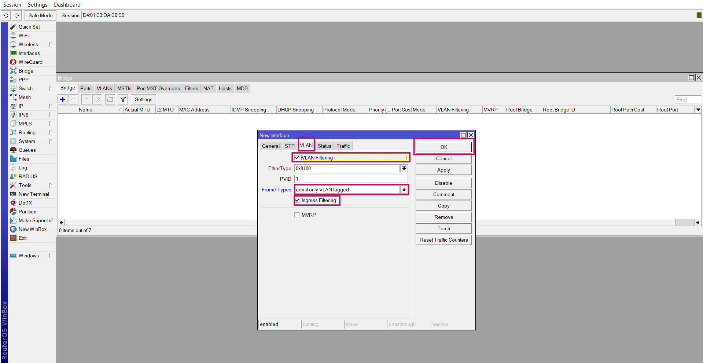
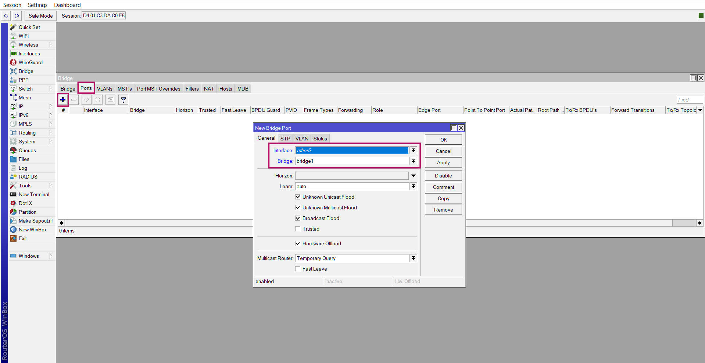
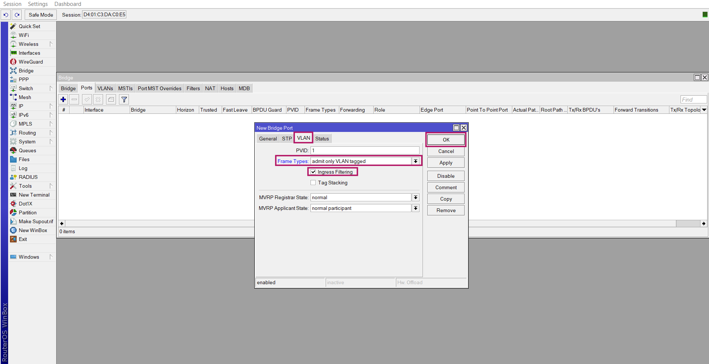
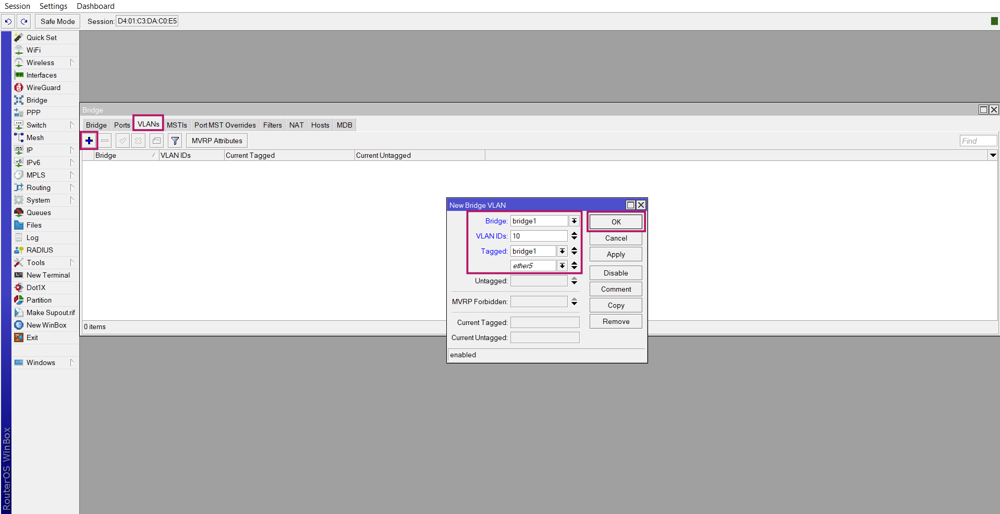
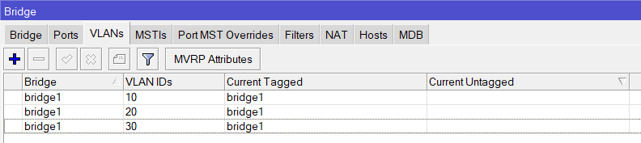
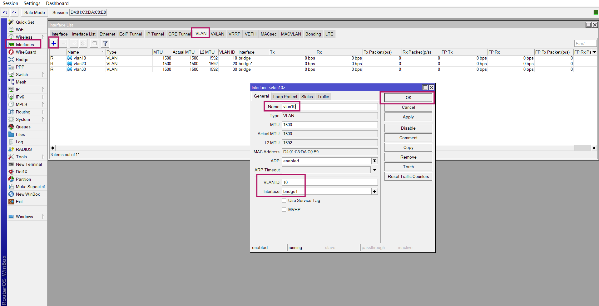
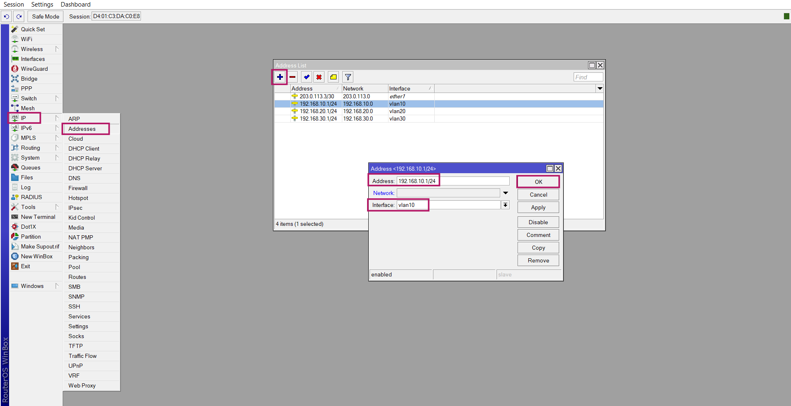
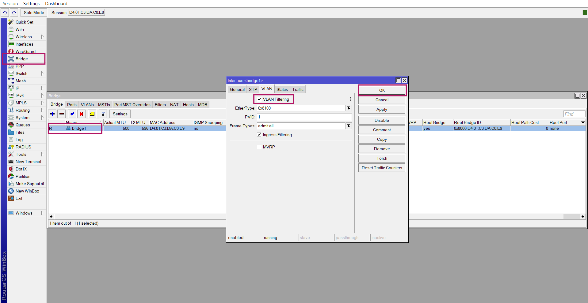

# VLAN на MikroTik - Router-on-a-Stick

> Курс: Комп'ютерні мережі, L1B | 2-3 курс

---

## 1 Схема мережі

> 📁 Зображення схеми: `assets/network-configs_vlans-mikrotik_1.svg`



| VLAN | Підмережа | Шлюз (MikroTik) | Призначення |
|------|-----------|-----------------|-------------|
| 10 | 192.168.10.0/24 | 192.168.10.1 | Адміністрування |
| 20 | 192.168.20.0/24 | 192.168.20.1 | Користувачі |
| 30 | 192.168.30.0/24 | 192.168.30.1 | Сервери |

!!! info "Метод налаштування"
    Використовується **Bridge VLAN Filtering** - офіційно рекомендований метод MikroTik для RouterOS 7. Всі VLAN-інтерфейси створюються поверх bridge-інтерфейсу

---

## 2 Налаштування MikroTik (RouterOS 7)

### 2.1 Крок 1 - Створити bridge з підтримкою VLAN

```
/interface bridge
add name=bridge1 \
    vlan-filtering=no \
    frame-types=admit-only-vlan-tagged \
    arp=reply-only \
    arp-timeout=30s
```

!!! warning "Важливо - порядок налаштування"
    `vlan-filtering=no` на старті - навмисно. Вмикаємо фільтрацію **в самому кінці** (крок 5), після того як все налаштовано. Якщо увімкнути одразу - можна втратити доступ до пристрою






---

### 2.2 Крок 2 - Додати trunk-порт у bridge

Порт `ether5` дивиться в бік комутатора Cisco і передає тегований трафік всіх VLAN

```
/interface bridge port
add bridge=bridge1 \
    interface=ether5 \
    frame-types=admit-only-vlan-tagged
```





---

### 2.3 Крок 3 - Додати VLAN-записи до Bridge VLAN Table

Тут вказуємо які VLAN дозволені на яких портах і в якому вигляді (tagged/untagged)

`bridge1` у полі Tagged — це CPU-порт маршрутизатора. Він дозволяє RouterOS отримувати і маршрутизувати VLAN-трафік

```
/interface bridge vlan
add bridge=bridge1 vlan-ids=10 tagged=bridge1,ether5
add bridge=bridge1 vlan-ids=20 tagged=bridge1,ether5
add bridge=bridge1 vlan-ids=30 tagged=bridge1,ether5
```





---

### 2.4 Крок 4 - Створити VLAN-інтерфейси

VLAN-інтерфейси - це логічні L3-інтерфейси поверх `bridge1`. Саме на них будуть IP-адреси (шлюзи для кожного VLAN)

```
/interface vlan
add name=vlan.10 interface=bridge1 vlan-id=10
add name=vlan.20 interface=bridge1 vlan-id=20
add name=vlan.30 interface=bridge1 vlan-id=30
```



Аналогічно для `vlan.20` (VLAN ID=`20`) та `vlan.30` (VLAN ID=`30`)

---

### 2.5 Крок 5 - Призначити IP-адреси на VLAN-інтерфейси

```
/ip address
add address=192.168.10.1/24 interface=vlan.10
add address=192.168.20.1/24 interface=vlan.20
add address=192.168.30.1/24 interface=vlan.30
```



Аналогічно для `192.168.20.1/24` на `vlan.20` та `192.168.30.1/24` на `vlan.30`

---

### 2.6 Крок 6 - Увімкнути VLAN Filtering

Тільки тепер вмикаємо фільтрацію. З цього моменту bridge починає обробляти VLAN-теги.

```
/interface bridge set bridge1 vlan-filtering=yes
```



!!! danger "Перевір підключення до CLI перед цим кроком"
    Після увімкнення `vlan-filtering` нетегований трафік на `ether5` буде відкинутий. Якщо ти підключений до маршрутизатора через цей порт без VLAN-тегу — втратиш доступ. Підключайся через інший порт або WinBox через WAN

---

### 2.7 Перевірка налаштувань

```
# Переглянути bridge та його VLAN-таблицю
/interface bridge print
/interface bridge vlan print

# Переглянути VLAN-інтерфейси
/interface vlan print

# Переглянути IP-адреси
/ip address print

# Перевірити стан bridge-портів
/interface bridge port print
```

### 2.8 Очікуваний результат після всіх налаштувань

```
[admin@MikroTik] > /interface bridge vlan print
Flags: X - disabled, D - dynamic
 #   BRIDGE   VLAN-IDS  CURRENT-TAGGED    CURRENT-UNTAGGED
 0   bridge1  10        bridge1,ether5
 1   bridge1  20        bridge1,ether5
 2   bridge1  30        bridge1,ether5

[admin@MikroTik] > /ip address print
Flags: X - disabled, I - invalid, D - dynamic
 #   ADDRESS            NETWORK         INTERFACE
 0   192.168.10.1/24    192.168.10.0    vlan.10
 1   192.168.20.1/24    192.168.20.0    vlan.20
 2   192.168.30.1/24    192.168.30.0    vlan.30
```

---

## 3 Налаштування транкового порту Cisco (сторона комутатора)

Порт `GigabitEthernet1/0/24` комутатора Cisco дивиться на `ether5` MikroTik і повинен бути налаштований як trunk

```
! Перейти до налаштування порту
interface GigabitEthernet1/0/24
 description "Uplink to MikroTik R1 ether5"
 switchport mode trunk
 switchport trunk allowed vlan 10,20,30
 no shutdown

! Перевірка
show interfaces GigabitEthernet1/0/24 trunk
show interfaces GigabitEthernet1/0/24 switchport
```

### 3.1 Налаштування access-портів на комутаторі Cisco

```
! Access-порт для VLAN 10
interface GigabitEthernet1/0/1
 switchport mode access
 switchport access vlan 10
 spanning-tree portfast
 no shutdown

! Access-порт для VLAN 20
interface GigabitEthernet1/0/2
 switchport mode access
 switchport access vlan 20
 spanning-tree portfast
 no shutdown

! Access-порт для VLAN 30
interface GigabitEthernet1/0/3
 switchport mode access
 switchport access vlan 30
 spanning-tree portfast
 no shutdown
```

### 3.2 Перевірка trunk між Cisco та MikroTik

```
! На Cisco:
show interfaces trunk

! Очікуваний вивід:
! Port        Mode   Encapsulation  Status    Native vlan
! Gi1/0/24    on     802.1q         trunking  1

! VLANs allowed and active in management domain:
! Gi1/0/24    10,20,30
```

---

> 📌 **Зберегти резервну копію MikroTik:** `System → Backup` або через CLI: `/system backup save`

> 📌 **Зберегти конфігурацію Cisco:** `write memory`

---

!!! quote "Джерело"
    Стаття базується на офіційній документації MikroTik
    Оригінал: [Basic VLAN switching — MikroTik Docs](https://help.mikrotik.com/docs/spaces/ROS/pages/103841826/Basic+VLAN+switching)