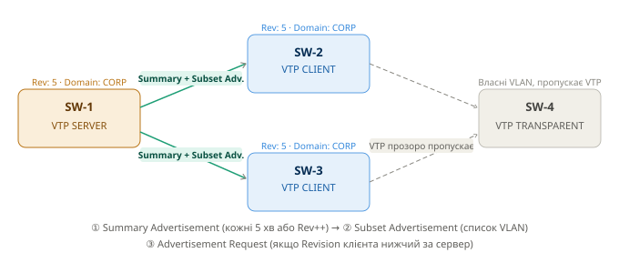
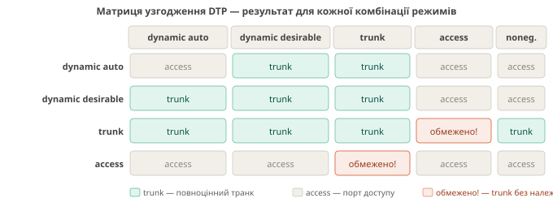

# VTP та DTP - Шпаргалка
 
> Курс: Мережеві технології автоматизації | 3 курс
 
---
 
## 1 VTP - VLAN Trunking Protocol
 
### 1.1 Проблематика
 
У великій мережі з десятками комутаторів адміністратор повинен вручну створювати однакові VLAN на кожному пристрої. При додаванні нового VLAN 50 - це 50 команд на 50 комутаторах. При помилці або пропуску - трафік не пройде. Масштабування перетворюється на рутину, яка легко призводить до помилок конфігурації
 
### Варіант вирішення
 
Централізована синхронізація: один комутатор (сервер) зберігає повний список VLAN і автоматично розповсюджує його на всі інші комутатори домену. Адміністратор вносить зміни тільки в одному місці
 
### Опис протоколу VTP
 
**VTP (VLAN Trunking Protocol)** - пропрієтарний протокол Cisco для централізованого розповсюдження інформації про VLAN між комутаторами по транкових каналах. Передає повідомлення на MAC-адресу `01-00-0C-CC-CC-CC` з SNAP-типом `2003`
  

---
**Три типи VTP-повідомлень:**
 
| Повідомлення | Коли надсилається | Зміст |
|---|---|---|
| **Summary Advertisement** | Кожні 5 хв або після зміни VLAN | Домен, Revision Number, MD5 |
| **Subset Advertisement** | Після Summary, при зміні VLAN | Повний список VLAN з параметрами |
| **Advertisement Request** | Якщо Revision клієнта < Revision сервера | Запит оновленої інформації |
---

**Configuration Revision Number** - лічильник змін. Кожна зміна VLAN на сервері збільшує його на 1. Комутатор з вищим Revision вважається актуальним джерелом
 
!!! danger "Ризик VTP Revision Number"
    Якщо підключити до мережі старий комутатор з вищим Revision Number (навіть у режимі Client) - він **перезапише** VLAN-базу всіх комутаторів домену! Завжди скидай Revision перед підключенням нового комутатора до існуючого домену
 
**Режими роботи VTP:**
 
| Режим | Може змінювати VLAN | Рекламує | Синхронізується | Пересилає VTP |
|---|---|---|---|---|
| **Server** | ✅ Так | ✅ Так | ✅ Так | ✅ Так |
| **Client** | ❌ Ні | ✅ Так | ✅ Так | ✅ Так |
| **Transparent** | ✅ Локально | ❌ Ні | ❌ Ні | ✅ Так (v2) |
| **Off** | ✅ Локально | ❌ Ні | ❌ Ні | ❌ Ні |
 
**VTP Pruning** - оптимізація трафіку: якщо на якомусь комутаторі немає портів в певному VLAN, флудований трафік цього VLAN не пересилається на нього по транку
 
```
Без pruning: broadcast VLAN 10 → надсилається на всі комутатори
З pruning:   broadcast VLAN 10 → тільки на комутатори з портами в VLAN 10
```
 
### 1.2 Порядок налаштування VTP
 
#### Крок 1 - Скинути Revision Number перед підключенням нового комутатора
 
```
! Метод 1: Змінити домен і повернути назад
Switch(config)# vtp domain TEMP
Switch(config)# vtp domain CORP
 
! Метод 2: Переключити в transparent і назад
Switch(config)# vtp mode transparent
Switch(config)# vtp mode server
 
! Перевірити що Revision = 0
Switch# show vtp status
```
 
#### Крок 2 - Налаштування VTP Server (основний комутатор)
 
```
! Налаштувати VTP домен та версію
vtp domain CORP
vtp version 2
vtp mode server
 
! VTP пароль (опціонально, але рекомендовано)
vtp password Str0ngVTPpass
 
! Перевірка
show vtp status
show vtp password
```
 
#### Крок 3 - Налаштування VTP Client (всі інші комутатори)
 
```
! Домен та пароль повинні збігатись з сервером!
vtp domain CORP
vtp version 2
vtp mode client
vtp password Str0ngVTPpass
 
! Перевірка (Revision повинен збігатись з сервером після синхронізації)
show vtp status
show vlan brief
```
 
#### Крок 4 - Налаштування VTP Transparent (якщо потрібно)
 
```
! Комутатор зберігає власні VLAN, але пересилає VTP-повідомлення далі
vtp mode transparent
vtp domain CORP        ! рекомендовано для пересилання в v1
 
! Перевірка
show vtp status
```
 
#### Крок 5 - Увімкнути VTP Pruning (на сервері)
 
```
! Увімкнути на сервері - поширюється на весь домен автоматично
vtp pruning
 
! Перевірити pruning-eligible VLAN на транку
show interfaces GigabitEthernet1/0/1 pruning
```
 
#### Крок 6 - Створення VLAN на VTP Server
 
```
! VTP Server - VLAN одразу синхронізуються на всі клієнти
vlan 10
 name USERS
vlan 20
 name SERVERS
vlan 30
 name MANAGEMENT
 
! Перевірка що VLAN з'явились на клієнтах
show vlan brief
```
 
#### Повна перевірка VTP
 
```
! Детальний статус
show vtp status
! Переглянути:
! VTP Operating Mode: Server / Client / Transparent
! VTP Domain Name: CORP
! Configuration Revision: має збігатись на сервері і клієнтах
! Number of existing VLANs: кількість VLAN
 
! Лічильники повідомлень
show vtp counters
 
! Переглянути VLAN-базу
show vlan brief
show vlan id 10
```
 
---
 
## 2 DTP - Dynamic Trunking Protocol
 
### 2.1 Проблематика
 
Адміністратор підключає новий комутатор до мережі. Потрібно вирішити: цей канал буде транковим (передає кілька VLAN) чи access (один VLAN)? Вручну налаштовувати кожен порт на обох кінцях каналу - довго і є ризик помилки конфігурації
 
### Варіант вирішення
 
Автоматичне узгодження режиму порту між двома комутаторами. Комутатори самостійно домовляються чи стане цей канал транковим
 
### Опис протоколу DTP
 
**DTP (Dynamic Trunking Protocol)** - пропрієтарний протокол Cisco рівня L2 для автоматичного узгодження транкових з'єднань між комутаторами Cisco. Надсилає фрейми на MAC `01-00-0C-CC-CC-CC`
 
!!! warning "DTP - тільки між Cisco"
    DTP не підтримується сторонніми пристроями. При підключенні до не-Cisco обладнання завжди вимикай DTP (`switchport nonegotiate`) і налаштовуй транк вручну
 
!!! danger "DTP - ризик безпеки (VLAN Hopping)"
    Зловмисник може підключити пристрій до порту в режимі `dynamic auto` або `dynamic desirable` і надіслати DTP-фрейми для переведення порту в trunk-режим. Це дає доступ до всіх VLAN мережі. **На портах до кінцевих пристроїв завжди вимикай DTP.**
 
**П'ять режимів DTP:**
 
| Режим | Дія | Надсилає DTP |
|---|---|---|
| `dynamic auto` | Стає trunk якщо сусід trunk або desirable | ✅ Так |
| `dynamic desirable` | Активно намагається стати trunk | ✅ Так |
| `trunk` | Завжди trunk, незалежно від сусіда | ✅ Так |
| `access` | Завжди access, ніколи не стає trunk | ❌ Ні |
| `nonegotiate` | Trunk без DTP-фреймів | ❌ Ні |


---

### 2.2 Порядок налаштування DTP
 
#### Сценарій 1 - Транк між двома комутаторами Cisco (статичний, рекомендовано)
 
```
! На обох комутаторах — явний транк без DTP
interface GigabitEthernet1/0/1
 description "Trunk to SW-2"
 switchport mode trunk
 switchport trunk encapsulation dot1q
 switchport nonegotiate                  ! вимкнути DTP
 switchport trunk allowed vlan 10,20,30  ! дозволити тільки потрібні VLAN
 switchport trunk native vlan 999        ! native vlan != 1 (безпека)
 no shutdown
```
 
#### Сценарій 2 - Транк до не-Cisco обладнання (MikroTik, Huawei)
 
```
! DTP не підтримується сторонніми пристроями — обов'язково nonegotiate
interface GigabitEthernet1/0/2
 description "Trunk to MikroTik"
 switchport mode trunk
 switchport nonegotiate
 switchport trunk allowed vlan 10,20,30
 no shutdown
```
 
#### Сценарій 3 - Access-порт до кінцевого пристрою (захист від VLAN Hopping)
 
```
! Явний access + вимикання DTP
interface GigabitEthernet1/0/10
 description "PC - VLAN 10"
 switchport mode access
 switchport access vlan 10
 switchport nonegotiate          ! заборонити DTP
 spanning-tree portfast
 no shutdown
```
 
#### Сценарій 4 - Dynamic desirable (автоматичне узгодження, тільки Cisco-to-Cisco)
 
```
! Порт активно намагається стати trunk якщо сусід підтримує
interface GigabitEthernet1/0/3
 switchport mode dynamic desirable
```
 
#### Дозволені VLAN та Native VLAN на транку
 
```
! Дозволити тільки конкретні VLAN (рекомендовано)
interface GigabitEthernet1/0/1
 switchport trunk allowed vlan 10,20,30
 
! Додати VLAN до існуючого списку
switchport trunk allowed vlan add 40
 
! Видалити VLAN зі списку
switchport trunk allowed vlan remove 30
 
! Дозволити всі VLAN (за замовчуванням)
switchport trunk allowed vlan all
 
! Native VLAN (трафік без тегів) — змінити з 1 для безпеки
switchport trunk native vlan 999
```
 
!!! info "Native VLAN повинен збігатись на обох кінцях"
    Якщо native VLAN відрізняється на двох кінцях транку — Cisco видасть попередження та може виникнути CDP-конфлікт або STP-петля.
 
#### Перевірка DTP та транку
 
```
! Стан DTP та режим порту
show interfaces GigabitEthernet1/0/1 switchport
! Переглянути:
! Administrative Mode: trunk / dynamic auto / dynamic desirable / access
! Operational Mode: trunk / static access
! Negotiation of Trunking: On / Off
 
! Деталі транкового каналу
show interfaces GigabitEthernet1/0/1 trunk
! Переглянути:
! Mode: on / desirable / auto
! Encapsulation: 802.1q
! Status: trunking / not-trunking
! VLANs allowed and active in management domain
 
! Всі транки на комутаторі
show interfaces trunk
 
! Перевірити конкретний VLAN на транку
show vlan id 10
```
 
---
 
## 3 Типові помилки та їх вирішення
 
| Симптом | Причина | Рішення |
|---|---|---|
| VLAN зник на клієнтах | Підключено комутатор з вищим Revision | Скинути Revision (`vtp domain TEMP` → назад), перевірити `show vtp status` |
| Транк не піднімається | Різні native VLAN або encapsulation | `show interfaces trunk`, вирівняти конфігурацію |
| Клієнт не синхронізує VLAN | Різний VTP domain або пароль | Перевірити `show vtp status`, `show vtp password` |
| DTP не погоджує транк | `auto + auto` = немає trunk | Один кінець поставити в `desirable` або `trunk` |
| VLAN Hopping атака | Access-порт у `dynamic auto` | `switchport mode access` + `switchport nonegotiate` |
| VTP не передає VLAN | Немає транкового порту | VTP працює тільки по транках, налаштувати trunk |
 
---
 
## 4 Рекомендований чекліст
 
```
✅ Скинути VTP Revision на новому комутаторі перед підключенням
✅ Встановити VTP пароль на всіх комутаторах домену
✅ На uplink-портах: switchport mode trunk + switchport nonegotiate
✅ На access-портах: switchport mode access + switchport nonegotiate
✅ Native VLAN змінити з 1 (наприклад, 999) на всіх транках
✅ switchport trunk allowed vlan — дозволити тільки потрібні VLAN
✅ VTP Pruning увімкнути для оптимізації флудового трафіку
✅ Перевірити: show vtp status, show interfaces trunk, show vlan brief
```
 
---
 
> 📌 **Зберегти конфігурацію:** `copy running-config startup-config` або `wr`
 
---
 
!!! quote "Джерела"
    Стаття базується на офіційній документації Cisco:
    [Understand VLAN Trunk Protocol (VTP)](https://www.cisco.com/c/en/us/support/docs/lan-switching/vtp/10558-21.html) — Cisco TAC, 2025;
[Configure VLAN Trunking - Cisco IOS XE 17](https://www.cisco.com/c/en/us/td/docs/switches/lan/c9000/lyr2-fwd/vlan/vlan-configuration-guide/configure-vlan-trunks.html) — Cisco Configuration Guide, 2026