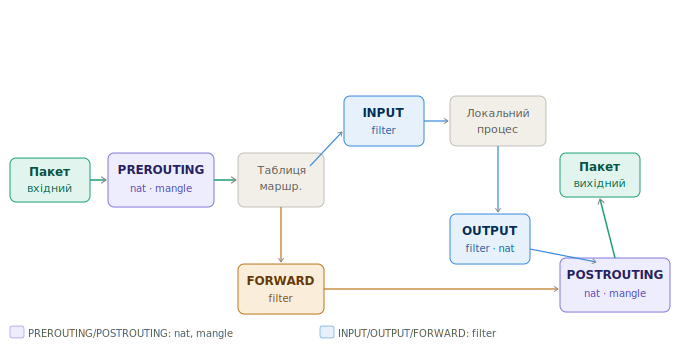
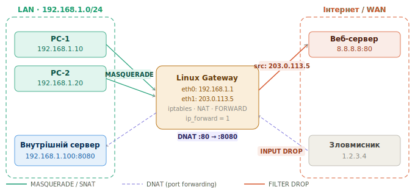

# iptables — Шпаргалка
 
> Курс: Безпека комп'ютерних мереж | 4 курс
 
---
 
## 1 Архітектура iptables
 
**iptables** - утиліта управління фільтрацією пакетів у Linux через підсистему **Netfilter** ядра. Кожен пакет проходить через ланцюжки правил (chains) в певному порядку залежно від напрямку руху
 
> 📁 Схема проходження пакетів: `assets/server-services_iptables_1.svg`


### 1.1 Таблиці (Tables)
 
| Таблиця | Призначення | Ланцюжки |
|---------|-------------|----------|
| **filter** | Фільтрація пакетів (за замовчуванням) | INPUT, OUTPUT, FORWARD |
| **nat** | Трансляція адрес | PREROUTING, OUTPUT, POSTROUTING |
| **mangle** | Зміна заголовків пакетів (TOS, TTL) | Всі |
| **raw** | Обхід connection tracking | PREROUTING, OUTPUT |
 
### 1.2 Ланцюжки (Chains) та їх призначення
 
```
PREROUTING  → пакет щойно прийшов на інтерфейс, ще до маршрутизації
              (тут: DNAT, зміна destination)
 
INPUT       → пакет призначений для самого хоста
              (тут: захист системи — дозволити/заблокувати вхідні)
 
FORWARD     → пакет проходить через хост транзитом (шлюз)
              (тут: фільтрація між мережами)
 
OUTPUT      → пакет створений локальним процесом, виходить назовні
              (тут: обмеження вихідного трафіку)
 
POSTROUTING → пакет вже маршрутизований, виходить на інтерфейс
              (тут: SNAT, MASQUERADE)
```
 
### 1.3 Дії (Targets)
 
| Target | Дія |
|--------|-----|
| `ACCEPT` | Пропустити пакет |
| `DROP` | Мовчки відкинути (відправник не знає) |
| `REJECT` | Відкинути з повідомленням про помилку |
| `LOG` | Записати у системний журнал і продовжити |
| `DNAT` | Змінити destination IP/port |
| `SNAT` | Змінити source IP/port |
| `MASQUERADE` | SNAT з динамічним IP (для DHCP-інтерфейсів) |
| `RETURN` | Повернутись до батьківського ланцюжка |
 
---
 
## 2 Базова фільтрація — захист самої системи
 
> 📁 Схема: `assets/iptables-packet-flow.svg` — пакети для самого хоста проходять через INPUT

 
### 2.1 Структура команди iptables
 
```bash
iptables -t <таблиця> -A <ланцюжок> <умови> -j <дія>
 
# Параметри:
# -t       таблиця (filter за замовчуванням)
# -A       додати правило в кінець (Append)
# -I       вставити правило на початок (Insert)
# -D       видалити правило (Delete)
# -R       замінити правило (Replace)
# -L       переглянути правила (List)
# -F       очистити ланцюжок (Flush)
# -P       встановити політику за замовчуванням (Policy)
# -n       не розв'язувати імена (numeric)
# -v       детальний вивід (verbose)
# --line-numbers  показати номери рядків
```
 
### 2.2 Базовий набір правил для захисту сервера
 
```bash
#!/bin/bash
# /etc/iptables/rules.sh — базова фільтрація
 
# --- Очистити всі правила ---
iptables -F
iptables -X
iptables -Z
 
# --- Політика за замовчуванням: DROP all, дозволяємо вибірково ---
iptables -P INPUT DROP
iptables -P FORWARD DROP
iptables -P OUTPUT ACCEPT          # вихідний трафік дозволено
 
# --- Дозволити loopback (localhost) ---
iptables -A INPUT -i lo -j ACCEPT
 
# --- Дозволити вже встановлені з'єднання (ESTABLISHED, RELATED) ---
# Це ключове правило — дозволяє відповіді на наші запити
iptables -A INPUT -m conntrack --ctstate ESTABLISHED,RELATED -j ACCEPT
 
# --- Дозволити ICMP (ping) ---
iptables -A INPUT -p icmp --icmp-type echo-request -j ACCEPT
 
# --- Дозволити SSH (порт 22) ---
iptables -A INPUT -p tcp --dport 22 -j ACCEPT
 
# --- Дозволити HTTP та HTTPS ---
iptables -A INPUT -p tcp --dport 80 -j ACCEPT
iptables -A INPUT -p tcp --dport 443 -j ACCEPT
 
# --- Логувати та відкинути решту ---
iptables -A INPUT -j LOG --log-prefix "iptables-DROP: " --log-level 4
iptables -A INPUT -j DROP
```
 
### 2.3 Фільтрація за IP-адресою
 
```bash
# Заблокувати конкретний IP повністю
iptables -A INPUT -s 1.2.3.4 -j DROP
 
# Заблокувати підмережу
iptables -A INPUT -s 10.10.10.0/24 -j DROP
 
# Дозволити SSH тільки з адміністративної мережі
iptables -A INPUT -p tcp --dport 22 -s 192.168.100.0/24 -j ACCEPT
iptables -A INPUT -p tcp --dport 22 -j DROP              # решта — DROP
 
# Заблокувати вихідні з'єднання на конкретний IP
iptables -A OUTPUT -d 203.0.113.1 -j DROP
```
 
### 2.4 Обмеження Rate Limiting (захист від brute-force)
 
```bash
# Обмежити SSH: не більше 3 нових з'єднань за 60 секунд з одного IP
iptables -A INPUT -p tcp --dport 22 -m state --state NEW \
    -m recent --set --name SSH-LIMIT
 
iptables -A INPUT -p tcp --dport 22 -m state --state NEW \
    -m recent --update --seconds 60 --hitcount 4 --name SSH-LIMIT \
    -j LOG --log-prefix "SSH-BRUTE-FORCE: "
 
iptables -A INPUT -p tcp --dport 22 -m state --state NEW \
    -m recent --update --seconds 60 --hitcount 4 --name SSH-LIMIT \
    -j DROP
 
# Захист від SYN-flood
iptables -A INPUT -p tcp --syn -m limit --limit 1/s --limit-burst 3 -j ACCEPT
iptables -A INPUT -p tcp --syn -j DROP
 
# Захист від ICMP-flood (ping)
iptables -A INPUT -p icmp --icmp-type echo-request \
    -m limit --limit 1/s -j ACCEPT
iptables -A INPUT -p icmp --icmp-type echo-request -j DROP
```
 
### 2.5 Захист від розповсюджених атак
 
```bash
# Відкинути невалідні пакети (не належать жодній сесії)
iptables -A INPUT -m conntrack --ctstate INVALID -j DROP
 
# Захист від Null-scan (пакети без прапорців TCP)
iptables -A INPUT -p tcp --tcp-flags ALL NONE -j DROP
 
# Захист від XMAS-scan (всі прапорці встановлені)
iptables -A INPUT -p tcp --tcp-flags ALL ALL -j DROP
 
# Захист від SYN+RST комбінації (неможлива в нормальному трафіку)
iptables -A INPUT -p tcp --tcp-flags SYN,RST SYN,RST -j DROP
 
# Відкинути фрагментовані пакети
iptables -A INPUT -f -j DROP
```
 
### 2.6 Перегляд та управління правилами
 
```bash
# Переглянути всі правила з лічильниками
iptables -L -v -n
iptables -L INPUT -v -n --line-numbers     # з номерами рядків
 
# Переглянути таблицю nat
iptables -t nat -L -v -n
 
# Видалити правило за номером рядка (наприклад рядок 3 в INPUT)
iptables -D INPUT 3
 
# Видалити конкретне правило
iptables -D INPUT -p tcp --dport 80 -j ACCEPT
 
# Очистити всі правила
iptables -F          # filter table
iptables -t nat -F   # nat table
 
# Скинути лічильники
iptables -Z
```
 
---
 
## 3 Збереження та автозавантаження правил
 
```bash
# Ubuntu/Debian — зберегти поточні правила
apt install -y iptables-persistent
netfilter-persistent save
 
# Або вручну
iptables-save > /etc/iptables/rules.v4
ip6tables-save > /etc/iptables/rules.v6
 
# Відновити правила
iptables-restore < /etc/iptables/rules.v4
 
# CentOS/RHEL
service iptables save
# або
iptables-save > /etc/sysconfig/iptables
```
 
!!! tip "Автозавантаження через systemd"
    З пакетом `iptables-persistent` правила автоматично відновлюються при кожному завантаженні системи з файлу `/etc/iptables/rules.v4`
 
---
 
## 4 Linux як шлюз між мережами (два інтерфейси)
 
> 📁 Схема шлюзу з NAT: `../assets/server-services_iptables_2.svg`

 
```
[LAN 192.168.1.0/24] ──eth0──► [Linux Gateway] ──eth1──► [Internet 203.0.113.5]
```
 
### 4.1 Увімкнути IP Forwarding (обов'язково!)
 
```bash
# Тимчасово (до перезавантаження)
echo 1 > /proc/sys/net/ipv4/ip_forward
 
# Постійно
echo "net.ipv4.ip_forward = 1" >> /etc/sysctl.conf
sysctl -p
 
# Перевірити
sysctl net.ipv4.ip_forward
cat /proc/sys/net/ipv4/ip_forward   # має бути 1
```
 
### 4.2 Базова фільтрація трафіку між мережами (FORWARD)
 
```bash
# Скинути FORWARD за замовчуванням
iptables -P FORWARD DROP
 
# Дозволити встановлені/пов'язані з'єднання (STATEFUL)
iptables -A FORWARD -m conntrack --ctstate ESTABLISHED,RELATED -j ACCEPT
 
# Дозволити трафік з LAN → Internet (eth0 → eth1)
iptables -A FORWARD -i eth0 -o eth1 -j ACCEPT
 
# Заблокувати трафік з Internet → LAN (eth1 → eth0) якщо не встановлено
iptables -A FORWARD -i eth1 -o eth0 -m conntrack --ctstate NEW -j DROP
 
# Дозволити конкретні сервіси з Internet → LAN (наприклад до сервера)
iptables -A FORWARD -i eth1 -o eth0 -p tcp --dport 80 \
    -d 192.168.1.100 -j ACCEPT
```
 
### 4.3 Фільтрація між VLAN / сегментами мережі
 
```bash
# Топологія: eth0=LAN, eth0.10=VLAN10(users), eth0.20=VLAN20(servers)
 
# Заборонити трафік між VLAN Users і VLAN Servers крім HTTP/HTTPS
iptables -A FORWARD -i eth0.10 -o eth0.20 -p tcp \
    --dport 80 -j ACCEPT
iptables -A FORWARD -i eth0.10 -o eth0.20 -p tcp \
    --dport 443 -j ACCEPT
iptables -A FORWARD -i eth0.10 -o eth0.20 -j DROP
 
# VLAN Servers може ходити в Internet
iptables -A FORWARD -i eth0.20 -o eth1 -j ACCEPT
 
# Заборонити VLAN Users пінгувати сервери
iptables -A FORWARD -i eth0.10 -o eth0.20 -p icmp -j DROP
```
 
---
 
## 5 NAT — трансляція адрес
 
> 📁 Схема: `assets/server-services_iptables_2.svg`

 
### 5.1 MASQUERADE — вихід LAN в Інтернет
 
Використовується коли IP на WAN-інтерфейсі **динамічний** (DHCP від провайдера)
 
```bash
# Всі пристрої LAN виходять через один динамічний IP на eth1
iptables -t nat -A POSTROUTING -s 192.168.1.0/24 -o eth1 -j MASQUERADE
 
# Перевірити
iptables -t nat -L POSTROUTING -v -n
```
 
### 5.2 SNAT — Static NAT (фіксована публічна адреса)
 
Використовується коли IP на WAN-інтерфейсі **статичний**. Ефективніше ніж MASQUERADE — не перевіряє IP щоразу
 
```bash
# Замінити source IP на фіксований 203.0.113.5
iptables -t nat -A POSTROUTING -s 192.168.1.0/24 -o eth1 \
    -j SNAT --to-source 203.0.113.5
 
# SNAT для конкретного хоста на іншу адресу
iptables -t nat -A POSTROUTING -s 192.168.1.50 -o eth1 \
    -j SNAT --to-source 203.0.113.10
```
 
### 5.3 DNAT — Destination NAT / Проброс портів (Port Forwarding)
 
Перенаправляє вхідні підключення до внутрішнього сервера
 
```bash
# Пробросити HTTP (80) ззовні → на внутрішній сервер :8080
# Запит: src=1.2.3.4 dst=203.0.113.5:80
# Після DNAT: src=1.2.3.4 dst=192.168.1.100:8080
iptables -t nat -A PREROUTING -i eth1 -p tcp --dport 80 \
    -j DNAT --to-destination 192.168.1.100:8080
 
# Дозволити цей трафік пройти через FORWARD
iptables -A FORWARD -i eth1 -o eth0 -p tcp --dport 8080 \
    -d 192.168.1.100 -j ACCEPT
 
# Пробросити HTTPS (443)
iptables -t nat -A PREROUTING -i eth1 -p tcp --dport 443 \
    -j DNAT --to-destination 192.168.1.100:443
 
# Пробросити SSH на нестандартному порту (2222 → внутрішній :22)
iptables -t nat -A PREROUTING -i eth1 -p tcp --dport 2222 \
    -j DNAT --to-destination 192.168.1.50:22
 
# Пробросити RDP (3389) до конкретного ПК
iptables -t nat -A PREROUTING -i eth1 -p tcp --dport 3389 \
    -j DNAT --to-destination 192.168.1.30:3389
```
 
!!! warning "DNAT потребує MASQUERADE або SNAT"
    Без правила в POSTROUTING відповідь від внутрішнього сервера буде йти напряму до клієнта (не через шлюз), і клієнт відкине пакет з невідомою IP-адресою. MASQUERADE в POSTROUTING вирішує це
 
### 5.4 PAT — Port Address Translation (один IP, різні порти)
 
По суті PAT = MASQUERADE або SNAT з портами. В iptables PAT реалізується автоматично при використанні MASQUERADE/SNAT — ядро відстежує трансляції по портах
 
```bash
# PAT з конкретним діапазоном портів
iptables -t nat -A POSTROUTING -s 192.168.1.0/24 -o eth1 \
    -j SNAT --to-source 203.0.113.5:10000-20000
#                                    ↑ діапазон портів для трансляцій
```
 
### 5.5 Hairpin NAT (доступ до публічної адреси зсередини LAN)
 
Ситуація: внутрішній сервер має DNAT, і клієнти з LAN хочуть звертатись до нього через публічний IP
 
```bash
# Клієнт з 192.168.1.x звертається до 203.0.113.5:80
# Потрібно: DNAT + MASQUERADE для трафіку що повертається всередину LAN
 
iptables -t nat -A PREROUTING -d 203.0.113.5 -p tcp --dport 80 \
    -j DNAT --to-destination 192.168.1.100:8080
 
# Masquerade для трафіку LAN→LAN через шлюз
iptables -t nat -A POSTROUTING -s 192.168.1.0/24 \
    -d 192.168.1.100 -p tcp --dport 8080 \
    -j MASQUERADE
```
 
---
 
## 6 Повна конфігурація шлюзу
 
```bash
#!/bin/bash
# /etc/iptables/gateway-rules.sh
# Шлюз: eth0=LAN(192.168.1.0/24), eth1=WAN(203.0.113.5)
 
LAN_IF="eth0"
WAN_IF="eth1"
LAN_NET="192.168.1.0/24"
WAN_IP="203.0.113.5"
INT_SERVER="192.168.1.100"
 
# IP Forwarding
echo 1 > /proc/sys/net/ipv4/ip_forward
 
# --- Очистити ---
iptables -F; iptables -X; iptables -Z
iptables -t nat -F; iptables -t nat -X
iptables -t mangle -F
 
# --- Політики за замовчуванням ---
iptables -P INPUT DROP
iptables -P FORWARD DROP
iptables -P OUTPUT ACCEPT
 
# ===================== INPUT (захист шлюзу) =====================
iptables -A INPUT -i lo -j ACCEPT
iptables -A INPUT -m conntrack --ctstate ESTABLISHED,RELATED -j ACCEPT
iptables -A INPUT -m conntrack --ctstate INVALID -j DROP
 
# SSH тільки з LAN
iptables -A INPUT -i $LAN_IF -p tcp --dport 22 -j ACCEPT
 
# DNS (якщо шлюз є DNS-резолвером для LAN)
iptables -A INPUT -i $LAN_IF -p udp --dport 53 -j ACCEPT
iptables -A INPUT -i $LAN_IF -p tcp --dport 53 -j ACCEPT
 
# DHCP
iptables -A INPUT -i $LAN_IF -p udp --dport 67 -j ACCEPT
 
# ICMP з LAN
iptables -A INPUT -i $LAN_IF -p icmp -j ACCEPT
 
# Логування та DROP
iptables -A INPUT -j LOG --log-prefix "GW-INPUT-DROP: " --log-level 4
iptables -A INPUT -j DROP
 
# ===================== FORWARD (між мережами) =====================
iptables -A FORWARD -m conntrack --ctstate ESTABLISHED,RELATED -j ACCEPT
iptables -A FORWARD -m conntrack --ctstate INVALID -j DROP
 
# LAN → Internet: дозволити тільки HTTP/HTTPS/DNS
iptables -A FORWARD -i $LAN_IF -o $WAN_IF -p tcp \
    -m multiport --dports 80,443 -j ACCEPT
iptables -A FORWARD -i $LAN_IF -o $WAN_IF -p udp --dport 53 -j ACCEPT
iptables -A FORWARD -i $LAN_IF -o $WAN_IF -p tcp --dport 53 -j ACCEPT
iptables -A FORWARD -i $LAN_IF -o $WAN_IF -p icmp -j ACCEPT
 
# Internet → внутрішній сервер (тільки HTTP, для DNAT)
iptables -A FORWARD -i $WAN_IF -o $LAN_IF -p tcp --dport 8080 \
    -d $INT_SERVER -j ACCEPT
 
# Логування та DROP
iptables -A FORWARD -j LOG --log-prefix "GW-FORWARD-DROP: " --log-level 4
iptables -A FORWARD -j DROP
 
# ===================== NAT =====================
# MASQUERADE — LAN → Internet
iptables -t nat -A POSTROUTING -s $LAN_NET -o $WAN_IF -j MASQUERADE
 
# DNAT — проброс HTTP ззовні → внутрішній сервер
iptables -t nat -A PREROUTING -i $WAN_IF -p tcp --dport 80 \
    -j DNAT --to-destination $INT_SERVER:8080
 
echo "Rules applied successfully"
iptables -L -v -n
```
 
---
 
## 7 Логування та діагностика
 
```bash
# Додати правило логування ПЕРЕД відповідним DROP
iptables -I INPUT 1 -p tcp --dport 22 -j LOG \
    --log-prefix "SSH-ATTEMPT: " --log-level 4
 
# Переглянути логи
tail -f /var/log/kern.log | grep iptables
tail -f /var/log/syslog | grep "iptables-DROP"
journalctl -kf | grep "GW-FORWARD"
 
# Переглянути активні NAT-трансляції (conntrack)
apt install -y conntrack
conntrack -L
conntrack -L -p tcp
conntrack -L --src-nat        # активні SNAT/MASQUERADE
conntrack -L --dst-nat        # активні DNAT
 
# Статистика по правилах (скільки пакетів спрацювало)
iptables -L -v -n --line-numbers
iptables -t nat -L -v -n
 
# Скинути лічильники
iptables -Z
 
# Трасування пакету (debug конкретного пакету)
iptables -t raw -A PREROUTING -s 1.2.3.4 -j TRACE
iptables -t raw -A OUTPUT -d 1.2.3.4 -j TRACE
# Потім переглянути
journalctl -k | grep "TRACE"
# Видалити після діагностики:
iptables -t raw -D PREROUTING -s 1.2.3.4 -j TRACE
```
 
### 7.1 Типові помилки
 
| Симптом | Причина | Рішення |
|---------|---------|---------|
| LAN не виходить в інтернет | Немає MASQUERADE або IP forwarding вимкнено | `sysctl net.ipv4.ip_forward`, перевірити POSTROUTING |
| DNAT не працює | Немає правила в FORWARD | Додати `FORWARD` дозвіл для трафіку після DNAT |
| Правила зникають після ребуту | Не збережено | `netfilter-persistent save` |
| SSH заблокований після застосування DROP | Порядок правил — DROP раніше ACCEPT | Перевірити `iptables -L -n --line-numbers`, перемістити правило |
| ESTABLISHED трафік блокується | Немає правила для `ctstate ESTABLISHED,RELATED` | Додати на початок INPUT/FORWARD |
 
---
 
!!! info "nftables — наступник iptables"
    У сучасних дистрибутивах (Ubuntu 22.04+, Debian 11+) рекомендується використовувати **nftables** замість iptables. Команди `iptables` там є обгорткою над nftables через `iptables-nft`. Синтаксис iptables залишається робочим, але для нових проєктів варто вивчити nftables
 