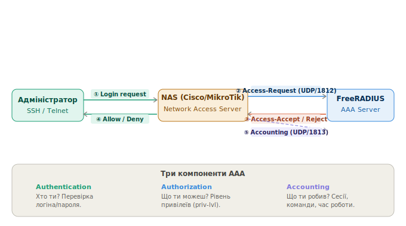

# Розгортання та налаштування RADIUS сервера
 
> Курс: Безпека електронно-комунікаційних мереж | 4 курс
 
---
 
## 1 Протокол RADIUS та принцип AAA
 
**RADIUS (Remote Authentication Dial-In User Service)** - мережевий протокол (RFC 2865/2866) для централізованої аутентифікації, авторизації та обліку (AAA) при доступі до мережевого обладнання
 

---

| Компонент | Функція |
|-----------|---------|
| **Authentication** | Хто ти? Перевірка логіна/пароля або сертифіката |
| **Authorization** | Що ти можеш? Визначення привілеїв (privilege level) |
| **Accounting** | Що ти робив? Запис сесій, команд, часу підключення |
 
**Порти:**
 
| Порт | Призначення |
|------|-------------|
| `UDP/1812` | Authentication та Authorization |
| `UDP/1813` | Accounting |
| `UDP/1645` | Authentication (застарілий, сумісність) |
| `UDP/1646` | Accounting (застарілий, сумісність) |
 
---
 
## 2 Розгортання FreeRADIUS
 
### 2.1 Встановлення
 
```bash
# Оновити систему та встановити FreeRADIUS
apt update && apt upgrade -y
apt install -y freeradius freeradius-utils
 
# Запуск та автозавантаження
systemctl start freeradius
systemctl enable freeradius
systemctl status freeradius
```
 
### 2.2 Структура конфігурації
 
```
/etc/freeradius/3.0/
├── radiusd.conf          ← головний конфіг (порти, логування, модулі)
├── clients.conf          ← NAS-клієнти (мережеве обладнання)
├── users                 ← локальні користувачі
├── mods-enabled/         ← увімкнені модулі (symlinks)
├── mods-available/       ← доступні модулі
├── sites-enabled/        ← увімкнені virtual servers
│   └── default           ← основний virtual server
└── certs/                ← сертифікати для EAP/TLS
```
 
### 2.3 Генерація сертифікатів (для EAP/TLS, 802.1X)
 
```bash
cd /etc/freeradius/3.0/certs/
chmod +x bootstrap
./bootstrap
```
 
---
 
## 3 Налаштування користувачів
 
Файл: `/etc/freeradius/3.0/users`
 
```
# Формат: username  Attribute := "value", Attribute2 = "value2"
 
# Базовий користувач для адміністрування обладнання
admin   Cleartext-Password := "P@$$w0rd"
        Service-Type = NAS-Prompt-User,
        Cisco-AVPair = "shell:priv-lvl=15"
 
# Звичайний оператор (privilege level 5)
operator   Cleartext-Password := "Op3r@t0r"
           Service-Type = NAS-Prompt-User,
           Cisco-AVPair = "shell:priv-lvl=5"
 
# Користувач тільки для читання (privilege level 1)
readonly   Cleartext-Password := "Readonly1"
           Service-Type = NAS-Prompt-User,
           Cisco-AVPair = "shell:priv-lvl=1"
```
 
!!! info "Cisco-AVPair shell:priv-lvl"
    `priv-lvl=15` — повний доступ (enable рівень).
    `priv-lvl=1` — тільки базові команди (`show`).
    `priv-lvl=5` — користувацький рівень (визначається через `privilege` команди на Cisco)
 
### 3.1 Налаштування NAS-клієнтів
 
Файл: `/etc/freeradius/3.0/clients.conf`
 
```
# Один конкретний пристрій
client cisco-r1 {
    ipaddr      = 10.60.254.1
    secret      = C!sc0123
    shortname   = cisco-r1
    nastype     = cisco
}
 
# Підмережа з мережевим обладнанням (Management VLAN)
client management-vlan {
    ipaddr      = 10.60.254.0/24
    secret      = Str0ngSecret!
    shortname   = mgmt-network
}
 
# MikroTik
client mikrotik-r1 {
    ipaddr      = 10.60.254.2
    secret      = Mikr0t!k
    shortname   = mikrotik-r1
    nastype     = other
}
```
 
!!! warning "Secret — спільний ключ"
    Secret повинен збігатись на NAS і в `clients.conf`. Використовуй різні secrets для різних пристроїв — якщо один пристрій скомпрометований, решта залишаться захищеними
 
### 3.2 Перезапуск та тестування
 
```bash
# Перезапустити після змін конфігурації
systemctl restart freeradius
 
# Зупинити сервіс та запустити в debug-режимі
systemctl stop freeradius
freeradius -X
 
# Тестування автентифікації через radtest
radtest admin P@$$w0rd 127.0.0.1 0 testing123
# Параметри: username password server nas-port-number secret
 
# Тестування з конкретного NAS IP
radtest admin P@$$w0rd 10.60.254.101 0 C!sc0123 -x
 
# Очікуваний успішний результат:
# Received Access-Accept Id 0 from 127.0.0.1:1812 to 0.0.0.0:0 length 20
```
 
---
 
## 4 Налаштування мережевих пристроїв
 
### 4.1 Cisco IOS — базова AAA для SSH
 
```
! Увімкнути AAA (обов'язковий перший крок)
aaa new-model
 
! Authentication: спочатку RADIUS, потім локальна БД як резерв
aaa authentication login default group radius local
 
! Authorization: привілеї визначаються RADIUS, резерв — локальна
aaa authorization exec default group radius local if-authenticated
 
! Accounting: запис подій початку/завершення сесії
aaa accounting exec default start-stop group radius
 
! Налаштування RADIUS-сервера (IOS 15+)
radius server RAD1
 address ipv4 10.60.254.101 auth-port 1812 acct-port 1813
 key C!sc0123
 timeout 5
 retransmit 3
 
! Додати резервний RADIUS-сервер
radius server RAD2
 address ipv4 10.60.254.102 auth-port 1812 acct-port 1813
 key C!sc0123
 
! Об'єднати сервери в групу
aaa group server radius RADIUS-SERVERS
 server name RAD1
 server name RAD2
 
! Використовувати групу в AAA
aaa authentication login default group RADIUS-SERVERS local
aaa authorization exec default group RADIUS-SERVERS local if-authenticated
 
! SSH налаштування
ip domain-name company.local
crypto key generate rsa modulus 2048
ip ssh version 2
 
line vty 0 4
 login authentication default
 transport input ssh
 exec-timeout 10 0
```
 
### 4.2 Cisco IOS — резервна локальна автентифікація при недоступності RADIUS
 
**Ключовий момент:** слово `local` в кінці рядка `aaa authentication login default group radius local` вже забезпечує fallback. Якщо всі RADIUS-сервери недоступні — IOS автоматично перемикається на локальну базу користувачів.
 
```
! Локальний користувач-резерв (обов'язково створити!)
username admin privilege 15 secret Loc@lP@$$w0rd
username operator privilege 5 secret Op3r@t0r
 
! AAA з явним fallback
aaa authentication login default group radius local
!                                               ↑
!                              fallback на локальну базу якщо RADIUS недоступний
 
! Додатково — окремий метод тільки для console (без RADIUS)
aaa authentication login CONSOLE-AUTH local
line con 0
 login authentication CONSOLE-AUTH
 exec-timeout 30 0
```
 
!!! danger "Обов'язково створи локального адміна!"
    Без локального fallback-користувача при недоступному RADIUS-сервері ти втратиш доступ до пристрою. Завжди створюй `username admin privilege 15 secret` і перевіряй що `local` є в рядку AAA.
 
!!! info "Поведінка fallback"
    `local` — використовує локальну базу якщо RADIUS **недоступний** (timeout).
    `local` НЕ використовується якщо RADIUS відповів **Access-Reject** (невірний пароль). В такому разі вхід просто відхиляється.
 
### 4.3 Cisco IOS — налаштування таймаутів RADIUS
 
```
! Глобальні таймаути (застарілий метод)
radius-server timeout 5
radius-server retransmit 2
radius-server deadtime 10      ! хвилини — не звертатись до мертвого сервера
 
! Нові команди (IOS 15+, в конфігурації сервера):
radius server RAD1
 address ipv4 10.60.254.101 auth-port 1812 acct-port 1813
 key C!sc0123
 timeout 5                     ! сек очікувати відповідь
 retransmit 2                  ! кількість повторних спроб
 
! Deadtime — не звертатись до недоступного сервера N хвилин
aaa group server radius RADIUS-SERVERS
 server name RAD1
 server name RAD2
 deadtime 5                    ! 5 хвилин пропускати недоступний сервер
```
 
### 4.4 MikroTik RouterOS
 
```
# Додати RADIUS-сервер
/radius
add address=10.60.254.101 \
    secret=C!sc0123 \
    service=login \
    authentication-port=1812 \
    accounting-port=1813 \
    timeout=5000 \
    comment="Primary RADIUS"
 
# Резервний RADIUS-сервер
/radius
add address=10.60.254.102 \
    secret=C!sc0123 \
    service=login \
    authentication-port=1812 \
    accounting-port=1813 \
    timeout=5000 \
    comment="Backup RADIUS"
 
# Увімкнути RADIUS для входу в систему
/radius incoming
set accept=yes
 
# Налаштування AAA
/user aaa
set use-radius=yes \
    accounting=yes \
    interim-update=5m
 
# Резервний локальний користувач (fallback)
/user
add name=localadmin \
    password=Loc@lP@$$w0rd \
    group=full \
    comment="Local fallback if RADIUS unavailable"
```
 
!!! info "MikroTik failover поведінка"
    MikroTik автоматично перемикається на локальних користувачів якщо всі RADIUS-сервери не відповідають. Порядок перевірки: спочатку всі RADIUS-сервери зі списку по черзі, потім — локальна база `/user`.
 
---
 
## 5 Cisco IOS — RADIUS для 802.1X (Port-Based Authentication)
 
802.1X — стандарт аутентифікації на рівні порту комутатора. Кінцевий пристрій (PC) повинен автентифікуватись через RADIUS перш ніж отримає доступ до мережі.
 
```
Схема: [PC (Supplicant)] ──EAP──► [SW (Authenticator)] ──RADIUS──► [FreeRADIUS (Auth Server)]
```
 
```
! Увімкнути dot1x глобально
aaa new-model
dot1x system-auth-control
 
! AAA для 802.1X
aaa authentication dot1x default group radius
aaa authorization network default group radius
 
! RADIUS-сервер
radius server RAD1
 address ipv4 10.60.254.101 auth-port 1812 acct-port 1813
 key C!sc0123
 
! Налаштування порту (access port для кінцевих пристроїв)
interface GigabitEthernet0/1
 switchport mode access
 switchport access vlan 10
 authentication port-control auto          ! увімкнути 802.1X
 dot1x pae authenticator
 authentication host-mode single-host      ! один пристрій на порту
 authentication order dot1x mab           ! спочатку 802.1X, потім MAB
 authentication priority dot1x mab
 spanning-tree portfast
```
 
### 5.1 MAB (MAC Authentication Bypass) — для пристроїв без 802.1X
 
Принтери, IP-камери, IoT-пристрої не підтримують 802.1X. MAB автентифікує їх за MAC-адресою.
 
```
interface GigabitEthernet0/2
 switchport mode access
 authentication port-control auto
 mab                                       ! увімкнути MAB
 dot1x pae authenticator
 authentication order mab dot1x           ! спочатку MAB, потім 802.1X
```
 
```bash
# На FreeRADIUS — додати MAC-адресу до users
# (MAC вводиться без роздільників, у нижньому регістрі)
# Файл: /etc/freeradius/3.0/users
 
001122334455  Cleartext-Password := "001122334455"
              Service-Type = Call-Check,
              Tunnel-Type = VLAN,
              Tunnel-Medium-Type = IEEE-802,
              Tunnel-Private-Group-Id = "20"     # VLAN для цього пристрою
```
 
### 5.2 Динамічне призначення VLAN через RADIUS
 
```bash
# Файл: /etc/freeradius/3.0/users
 
# Користувач отримає VLAN 10 (Users)
john   Cleartext-Password := "Password123"
       Tunnel-Type = VLAN,
       Tunnel-Medium-Type = IEEE-802,
       Tunnel-Private-Group-Id = "10"
 
# Адміністратор отримає VLAN 100 (Management)
admin   Cleartext-Password := "AdminPass"
        Tunnel-Type = VLAN,
        Tunnel-Medium-Type = IEEE-802,
        Tunnel-Private-Group-Id = "100"
```
 
---
 
## 6 Налаштування FreeRADIUS для роботи з базою даних (MySQL)
 
Для великих мереж зберігання користувачів у файлі `users` стає незручним. FreeRADIUS підтримує SQL-бази даних.
 
```bash
# Встановити пакет
apt install -y freeradius-mysql libmysqlclient-dev mysql-server
 
# Налаштувати базу даних
mysql -u root -p <<EOF
CREATE DATABASE radius;
CREATE USER 'radius'@'localhost' IDENTIFIED BY 'radpass';
GRANT ALL PRIVILEGES ON radius.* TO 'radius'@'localhost';
FLUSH PRIVILEGES;
EOF
 
# Імпортувати схему
mysql -u radius -p radius < /etc/freeradius/3.0/mods-config/sql/main/mysql/schema.sql
 
# Увімкнути модуль SQL
ln -s /etc/freeradius/3.0/mods-available/sql /etc/freeradius/3.0/mods-enabled/sql
```
 
```
# Файл: /etc/freeradius/3.0/mods-enabled/sql
sql {
    dialect = "mysql"
    driver = "rlm_sql_mysql"
    server = "localhost"
    port = 3306
    login = "radius"
    password = "radpass"
    radius_db = "radius"
    read_clients = yes
    client_table = "nas"
}
```
 
```bash
# Додати користувача через SQL
mysql -u radius -p radius <<EOF
INSERT INTO radcheck (username, attribute, op, value)
VALUES ('admin', 'Cleartext-Password', ':=', 'P@$$w0rd');
 
INSERT INTO radreply (username, attribute, op, value)
VALUES ('admin', 'Cisco-AVPair', '=', 'shell:priv-lvl=15');
 
INSERT INTO radreply (username, attribute, op, value)
VALUES ('admin', 'Service-Type', '=', 'NAS-Prompt-User');
EOF
```
 
---
 
## 7 Перевірка та діагностика
 
```bash
# Debug-режим FreeRADIUS (зупинити сервіс спочатку!)
systemctl stop freeradius
freeradius -X | grep -E "Login|REJECT|ACCEPT|ERROR"
 
# Тестування конкретного користувача
radtest admin P@$$w0rd 127.0.0.1 0 testing123
 
# Тестування з NAS IP (важливо для перевірки clients.conf)
radtest -n 1 admin P@$$w0rd 10.60.254.101 0 C!sc0123
 
# Тестування accounting
radclient 10.60.254.101:1813 acct C!sc0123 <<EOF
Acct-Status-Type = Start
User-Name = admin
NAS-IP-Address = 10.60.254.1
Acct-Session-Id = test-session-001
EOF
 
# Перегляд логів
tail -f /var/log/freeradius/radius.log
 
# На Cisco — перевірити стан RADIUS
show aaa servers
show radius statistics
show radius server-groups
debug radius authentication
debug radius accounting
no debug all
```
 
### 7.1 Типові помилки
 
| Помилка | Причина | Рішення |
|---------|---------|---------|
| `Access-Reject` | Невірний пароль або користувач | Перевірити запис у `users` |
| `No response` | NAS не в `clients.conf` або невірний secret | Додати клієнт, перевірити IP |
| `Connection refused` | FreeRADIUS не запущений або закритий порт | `systemctl status freeradius`, `ufw allow 1812/udp` |
| Cisco: `%AAA-I-CONNECT` | Успішне підключення через RADIUS | Норма |
| Cisco: `%AAA-I-DISCONNECT` | Відключення — записано в Accounting | Норма |
| MikroTik: `timeout` | RADIUS не відповідає | Перевірити IP, secret, firewall |
 
---
 
> 📌 **Після кожної зміни конфігурації FreeRADIUS:**
> ```bash
> systemctl restart freeradius && radtest admin P@$$w0rd 127.0.0.1 0 testing123
> ```
 